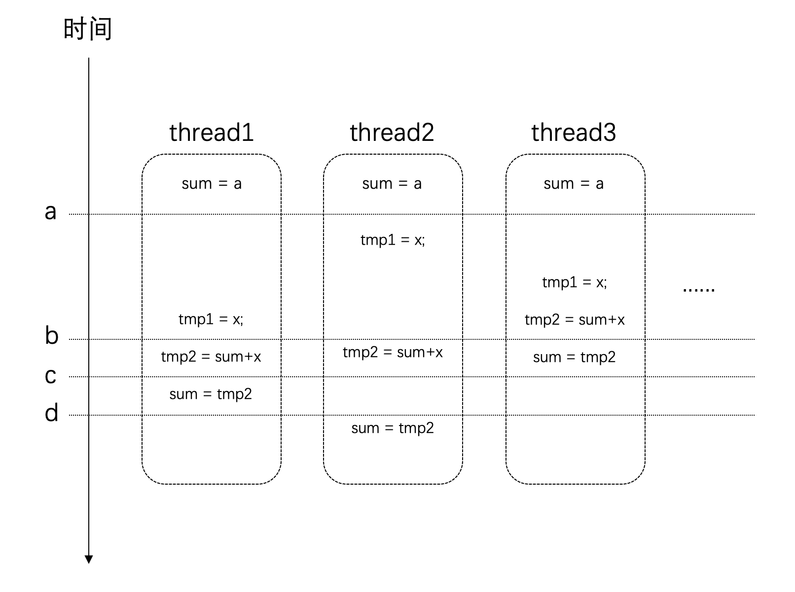

# 并发编程

<!--toc:start-->

- [并发编程](#并发编程)
- [线程](#线程)
  - [线程的创建](#线程的创建)
    - [detach 和 join](#detach-和-join)
    - [管理线程](#管理线程)
    - [线程的归属权](#线程的归属权)
    - [异常处理](#异常处理)
    - [慎用隐式转换](#慎用隐式转换)
    - [引用参数](#引用参数)
    - [绑定类成员函数](#绑定类成员函数)
    - [使用move操作](#使用move操作)
    - [一次调用](#一次调用)
    - [并发任务](#并发任务)
    - [竞争条件与临界区](#竞争条件与临界区)
  - [互斥体与锁](#互斥体与锁)
    - [mutex](#mutex)
    - [锁的使用](#锁的使用)
    - [死锁](#死锁)
      - [死锁是如何造成的](#死锁是如何造成的)
      - [同时加锁](#同时加锁)
      - [层级锁](#层级锁)
    - [C++ unique_lock,共享锁和递归锁](#c-uniquelock共享锁和递归锁)
      - [unique_lock](#uniquelock)
      - [共享锁](#共享锁)
      - [递归锁](#递归锁)
  - [利用条件变量实现线程安全队列](#利用条件变量实现线程安全队列)
    - [条件变量](#条件变量)
    - [线程安全队列](#线程安全队列)
  - [C++并发三剑客 future , promise , async](#c并发三剑客-future-promise-async)
    - [async用法](#async用法)
      - [async的启动策略](#async的启动策略)
    - [future的wait和get](#future的wait和get)
      - [将任务和future关联](#将任务和future关联)
    - [promise的用法](#promise的用法)
  - [共享型的future](#共享型的future) - [异常处理](#异常处理)
  <!--toc:end-->

# 线程

## 线程的创建

```c++
#include <iostream>
#include <thread>


void func() {
    std::cout << "hello world\n";
}

int main() {

    std::thread t1(func);
    t1.join();

    return 0;
}

```

如果函数需要传参

```c++
#include <iostream>
#include <thread>


void func(std::string name) {
    std::cout << name << "\n";
}

int main() {

    std::thread t1(func , "127.0.0.1");
    t1.join();

    return 0;
}

```

仿函数作为参数

```c++
class Background_task {
public:
    void operator[](const std::string& str) {
        std::cout << str << "\n";
    };
};
```

注意：

如果采用如下的方式调用函数，编译器一定会报错

```c++
    std::thread t1(Background_task());
    t1.join();
```

因为编译器会将t1当作一个函数对象，返回一个`std::thread`类型的值，函数的参数为一个函数指针，该函数指针返回值为`Back_ground_task`，参数为void

```c++
std::thread (*)(Background_task (*)());
```

修改的方式如下

```c++
    std::thread t1((background_task()));
    t1.join();
    std::thread t2{background_task()};
    t2.join();
```

lambda表达式作为参数

```c++
    std::thread t1([](const std::string& str){
        std::cout << str << "\n";
    } , "hello world\n");
    t1.join();

```

注意在线程中参数是以拷贝的形式进行传递，因此对于拷贝耗时的对象可以选择用引用或者指针进行传递。但是需要考虑对象的生命周期。因为线程的运行长度可能会超过参数的生命周期，这个时候如果线程还在访问一个已经被销毁的对象就会出现问题

### detach 和 join

> 主要API

一旦启动线程之后，我们必须决定是要等待到这个线程结束(join)，或者直接和主线程独立开来(detach)，我们必须二者选其一。如果`std::thread`对象销毁时我们还没有触发任何操作，则`std::thread`对象在析构函数将调用`std::terminate()`从而导致进程异常退出

- `join`: 调用这个API时，当前线程就会停滞，直到目标线程执行完毕。

- `detach`: 这个API是让目标线程成为守护线程。一旦`detach`之后，目标线程将独立运行，即便其对应的`std::thread`对象销毁也不影响线程的执行。并且无法与之通信。

对于这两个接口，都必须是可执行的线程才有意义。可以通过`joinable()`接口查询是否可以对它们进行`join`或者`detach`

### 管理线程

- `yield`: 通常在自己的主要任务已经完成时，希望让出处理器给其他任务使用

- `get_id`: 返回当前线程的id，可以用来标识不同的线程

- `sleep_for`: 可以让当前线程停滞一段时间

- `sleep_until`: 和`sleep_for`类似，但是以具体时间点为参数，这两个API都是以`chrono`api为基础

```c++
#include <iomanip>
#include <iostream>
#include <thread>
#include <sstream>

void print_time() {
    auto now = std::chrono::system_clock::now();
    auto in_time_t = std::chrono::system_clock::to_time_t(now);

    std::stringstream ssin;
    ssin << std::put_time(std::localtime(&in_time_t) , "%Y-%m-%d %X");
    std::cout << "now is: " << ssin.str() << "\n";

}

void sleep_thread() {
    std::this_thread::sleep_for(std::chrono::seconds(3));
    std::cout << "[thread-" << std::this_thread::get_id() << "] is waking up\n";
}

void loop_thread() {
    for(int i = 0; i < 10; i++) {
        std::cout << "[thread-" << std::this_thread::get_id() << "] print: " << i << "\n";
    }
}

int main() {
    print_time();
    std::thread t1(sleep_thread) , t2(loop_thread);
    t1.join();
    t2.detach();
    print_time();

    return 0;
}

```

### 线程的归属权

> 每个线程都有其归属权，也就是说归属给每个变量管理

```c++

void func() {

}

std::thread t1(func);

```

`t1`是一个线程变量，管理一个线程，该线程执行`func()`对于`std::thread`C++不允许拷贝构造和拷贝赋值，所以只能通过移动和局部变量返回的方式将线程变量管理权转移给其他变量管理。

例如下面的例子

```c++
#include <iostream>
#include <thread>
#include <chrono>

namespace {
void func1() {
    while(true) {
        std::this_thread::sleep_for(std::chrono::seconds(1));
    }
}
void func2() {
    while(true) {
        std::this_thread::sleep_for(std::chrono::seconds(1));
    }
}

}; // namespace
int main() {
    //1. t1绑定函数func1()
    std::thread t1(func1);
    //2. 转移t1的管理的线程给t2，转移后t1无效
    std::thread t2 = std::move(t1);
    //3. t1绑定函数func2()
    t1 = std::thread(func2);
    //4. 新建一个线程t3
    std::thread t3;
    //5. 转移t2管理的线程给t3，，
    t3 = std::move(t2);
    //6. 转移t3管理的线程给t1
    t1 = std::move(t3);
    //BUG:不可以将一个线程的管理权交给一个已经绑定线程的变量，
    //否则会触发线程的terminate函数引发崩溃
    // t1 = std::move(t3);
    std::this_thread::sleep_for(std::chrono::seconds(2000));

    return 0;
}

```

### 异常处理

当我们启动一个线程之后，如果主线程崩溃，会导致子线程也会异常退出，调用`std::terminate()`，如果自线程在进行一些重要的操作比如将充值信息入库等，丢失这些信息是很为危险的。所以常用的做法是捕获异常，并且在异常情况下保证子线程稳定运行结束后，主线程抛出异常结束运行

```c++
void catch_exception() {
    int some_local_state = 0;
    std::function<void()> myfunc = [](){
        // doing something
    };

    std::thread functhread(myfunc);
    try{
        // 本线程做的一些事情，可能引发崩溃
        std::this_thread::sleep_for(std::chrono::seconds(1));
    } catch (std::exception& e) {
        functhread.join();
        throw std::runtime_error("ababababa\n");
    }

    functhread.join();
}
```

但是用这种方式编码会显得臃肿，可以使用`RAII`技术，保证线程对象析构的时候等待线程运行结束，回收资源。

```c++
class thread_guard {
private:
    std::thread& _t;
public:
    explicit thread_guard(std::thread& t) : _t(t) {}
    ~thread_guard() {
        if(_t.joinable()) {
            _t.join();
        }
    }
    thread_guard(const thread_guard&) = delete;
    thread_guard& operator=(const thread_guard&) = delete;
};

void auto_guard() {
    int some_local_state = 0;
    std::function<void()> myfunc = [](){
        // doing something
    };

    std::thread t1(myfunc);
    thread_guard guard(t1);
    std::cout << "auto guard finish\n";
}

```

### 慎用隐式转换

C++中会有一些隐式转换，例如`char*`转换为`std::string`等，这些隐式转换在线程的调用上可能会造成崩溃问题

```c++
    void danger_oops(int som_param) {
        char buffer[1024];
        sprintf(buffer, "%i", som_param);
        //在线程内部将char const* 转化为std::string
        //指针常量  char const*  指针本身不能变
        //常量指针  const char * 指向的内容不能变
        std::thread t(print_str, 3, buffer);
        t.detach();
        std::cout << "danger oops finished " << std::endl;
    }
```

在以上代码中，当我们定义一个线程变量`thread t`时，传递给这个线程参数`buffer`会被保存到`thread`的成员变量中。而在线程对象t内部启动并运行线程时，参数才会被传递给调用函数`print_str`。而此时`buffer`可能到`}`就被销毁了。改进方式很简单，我们将参数传递给`thread`时显示转换成`string`就可以了，其实相当于拷贝一份过去。

```c++
        void danger_oops(int som_param) {
        char buffer[1024];
        sprintf(buffer, "%i", som_param);
        //在线程内部将char const* 转化为std::string
        //指针常量  char const*  指针本身不能变
        //常量指针  const char * 指向的内容不能变
        std::thread t(print_str, 3, std::string(buffer));
        t.detach();
        std::cout << "danger oops finished " << std::endl;
    }

```

### 引用参数

在线程要调用的回调函数参数作为引用类型时，需要将参数显式转换为引用对象传递给构造函数，如果采用如下调用会编译失败

```c++
void change_param(int& param) {
    ++param;
}

void ref_oops(int some_param) {
    std::cout << "before change , param is " << some_param << std::endl;
    // 需要引用显式转换
    std::thread t2(change_param , some_param);
    t2.join();
    std::cout << "after change , param is " << some_param << std::endl;
}
```

即使函数`change_param`的参数为`int&`类型，我们传递给t2的构造函数为`some_param`，也不会达到在`change_param`函数内部修改关联到外部`some_param`的效果。因为`some_param`在传递给`thread`的构造函数后会转变为右值保存，右值传递给一个左值引用会出问题，所以编译也出了问题。

[thread原理](https://llfc.club/category?catid=225RaiVNI8pFDD5L4m807g7ZwmF#!aid/2TayNx5QxbGTaWW5s48vMjtuvCB)

只需要使用`std::ref()`就可以解决

```c++

void change_param(int& param) {
    ++param;
}

void ref_oops(int some_param) {
    std::cout << "before change , param is " << some_param << std::endl;
    // 需要引用显式转换
    std::thread t2(change_param , std::ref(some_param));
    t2.join();
    std::cout << "after change , param is " << some_param << std::endl;
}

```

### 绑定类成员函数

有时候我们需要绑定一个类的成员函数。

```c++
class X {
public:
    void do_length_work() {
        std::cout << "do_length_work" << std::endl;
    }
};

void bind_class_oops() {
    X my_x;
    std::thread t(&X::do_length_work , &my_x);
    t.join();
}

```

注意，如果`thread`绑定的是普通函数，可以在函数前加`&`或者不加`&`，因为编译器默认将普通函数名作为函数地址，但是如果是绑定类的成员函数，必须加`&`

```c++
    void thead_work1(std::string str) {
        std::cout << "str is " << str << std::endl;
    }
    std::string hellostr = "hello world!";
    //两种方式都正确
    std::thread t1(thead_work1, hellostr);
    std::thread t2(&thead_work1, hellostr);
```

### 使用move操作

有时候传递给线程的参数是独占的，所谓独占就是不支持拷贝赋值和构造，但是我们可以通过`std::move()`的方式将参数的所有权转移给线程。

```c++
void deal_unqiue(std::unique_ptr<int> p) {
    std::cout << "unique ptr data is " << *p << std::endl;
    (*p)++;
    std::cout << "after unqiue ptr data is " << *p << std::endl;
}

void move_oops() {
    auto p = std::make_unique<int>(100);
    std::thread t(deal_unqiue , std::move(p));
    t.join();

}
```

### 一次调用

在一些情况下，我们有些任务需要执行一次，并且我们只希望它执行一次，例如资源的初始化人物。这个时候就可以用到`std::call_once`和`std::once_flag`。这两个接口保证即便在多线程的环境下，相应的函数也只会调用一次。

例如下面的代码，有四个线程会执行`init()`函数，但是只有一个线程会执行。

```c++
#include <iostream>
#include <thread>
#include <mutex>

void init() { std::cout << "Initializing .....\n"; }

void worker( std::once_flag *flag ) { std::call_once( *flag, init ); }

int main() {
    std::once_flag flag;

    std::thread t1( worker, &flag );
    std::thread t2( worker, &flag );
    std::thread t3( worker, &flag );
    std::thread t4( worker, &flag );

    t1.join();
    t2.join();
    t3.join();
    t4.join();

    return 0;
}
```

注意，我们无法确定哪个线程执行了`init()`函数，但是我们也不需要关心，因为只要有一个线程执行了`init()`函数就可以了

### 并发任务

实例：需要计算某个范围内所有数的平方根总和

```c++
#include <iostream>
#include <thread>
#include <mutex>
#include <cmath>
#include <chrono>

static int MAX = 10e8;
static double sum = 0;

void func(int min , int max) {
    for(int i = min ; i <= max; i++) {
        sum += sqrt(i);
    }
}

void task(int min , int max) {
    // 得到调用func之前的时间
    auto start_time = std::chrono::steady_clock::now();
    sum = 0;
    func(min , max);
    // 得到调用后func之后的时间
    auto end_time = std::chrono::steady_clock::now();
    // 得到持续的时间
    auto ms = std::chrono::duration_cast<std::chrono::milliseconds>(end_time - start_time).count();
    std::cout << "Task finish, " << ms << " ms consumed , Result: " << sum << "\n";
}

int main() {
    task(1 , MAX);

    return 0;
}

```

输出为

```
Task finish, 1821 ms consumed , Result: 2.10819e+13
```

很明显上面的计算使用单线程性能太差，可以使用并发进行。

1. 先获取当前硬件支持多少个线程并行执行
2. 根据处理器情况决定线程数量
3. 对于每一个线程都通过`func()`函数来完成任务，并划分一部分数据给它处理
4. 等待每一个线程结束。

```c++
void concurrent_task(int min , int max) {
    auto start_time = std::chrono::steady_clock::nowxainshi();
    // 得到线程数量
    unsigned int concurrent_count = std::thread::hardware_concurrency();
    std::cout << "hardware_concurrency: " << concurrent_count << "\n";
    std::vector<std::thread> threads;
    min = 0;
    sum = 0;
    for(int t = 0; t < concurrent_count; t++) {
        int range = max / concurrent_count * (t + 1);
        threads.push_back(std::thread(func , min , range));
        min = range + 1;
    }

    for(auto &i : threads) {
        i.join();
    }
    auto end_time = std::chrono::steady_clock::now();
    auto ms = std::chrono::duration_cast<std::chrono::milliseconds>(end_time - start_time).count();
    std::cout << "Task finish, " << ms << " ms consumed , Result: " << sum << "\n";
}
```

输出如下

```
hardware_concurrency: 20
Task finish, 2086 ms consumed , Result: 1.53287e+12
```

但是我们会发现性能并没有多少提升，并且结果还是错的。

要搞清楚为什么，我们需要一点背景知识

对于现代处理器来说，为了加速处理的速度，每个处理器都会有自己的高速缓存，这个高速缓存是与每个处理相对应的

> 现在的处理器起码有三级缓存
> 

处理器在进行计算的时候，高速缓存会参与其中，例如数据的读和写。而高速缓存和系统主存（Memory）是有可能存在不一致的。即：某个结果计算后保存在处理器的高速缓存中了，但是没有同步到主存中，此时这个值对于其他处理器就是不可见的。

事情还没有这么简单。我们对于全局变量值的修改`sum += sqrt(i);`这条语句，它并非是原子的。它其实很多条指令的组合才完成的。假设在某个设备上，这条语句通过下面这几个步骤来完成的，时序可能如下：



如图所示，在时间点a的时候，所有线程对于`sum`变量的值是一致的。

但是在时间点b之后，thread3上已经对`sum`进行了赋值，而这个时候其他几个线程也同时在其他处理器上使用了这个值，那么这个时候它们所使用的值是旧的，也就是错误的。最后得到的结果也就是错误的。

### 竞争条件与临界区

当多个进程或者线程同时访问共享数据时，只要有一个任务会修改数据，那么就可能会发生问题。此时结果依赖于这些任务执行的相对时间，这种场景称为[竞争条件](https://zhuanlan.zhihu.com/p/426072739)

访问共享数据的代码片段称之为**临界区**。例如上面的实例，临界区就是读写`sum`变量的地方

要避免竞争条件，就需要对临界区进行数据保护。

那么对于上面的实例的解决方法就是一次只让一个线程访问共享数据，访问完了再让其他线程接着访问，这样就可以避免问题发生了。

## 互斥体与锁

### mutex

开发并发系统的目的主要是为了提升性能：将任务分散到多个线程，然后在不同的处理器上同时执行。这些分散开来的线程通常会包含两类任务：

1. 独立的对于划分给自己的数据进行处理
2. 对于结果的汇总

其中第一项任务由于每个线程都是独立的，不存在竞争条件的问题。而第二个任务，由于所有的线程都可能往总结果汇总，这就需要做保护了。
在某一个具体的时刻，只应当有一个线程更新结果，即：保证每个线程对于共享数据的访问是"互斥的"，`mutex`就提供了这样的功能。

| 方法     | 说明                                      |
| -------- | ----------------------------------------- |
| lock     | 加锁，如果不可用，则阻塞                  |
| try_lock | 尝试加锁，如果mutex不可以用直接返回(bool) |
| unlock   | 解开互斥锁                                |

这三个方法提供了基础的锁定和解除锁定的功能。使用`lock`意味着你有很强的意愿一定要获取到互斥体，而使用`try_lock`则是进行一次尝试。这意味着如果失败了，你通常还有其他的路径可以走。

在这些基础功能之上，其他的类分别在下面三个方面进行了扩展

- 超时： `timed_mutex`, `recursive_timed_mutex`, `shared_timed_mutex`的名称都带有`timed`,这意味着它们都支持超时的功能。它们都提供了`try_lock_for`和`try_lock_until`方法，这两个方法分别可以制定超时的时间长度和时间点。如果在超时的时间范围内没有能获取到锁，则直接返回，不再继续等待。

- 可重入：`rescursive_mutex`和`recursive_timed_mutex`的名称都带有`rescursive`。可重入或者叫做可递归，是指在同一个线程中，同一把锁可以锁定多次。这就避免了一些不必要的死锁。

- 共享：`shared_timed_mutex`和`shared_mutex`提供了共享功能。对于这类互斥体，实际上是提供了两把锁：一把是共享锁、一把是互斥锁。一旦某个线程获取了互斥锁，任何其他线程都无法再获取互斥锁和共享锁;但是如果有某个线程获取到了共享锁，其他线程无法再获取到互斥锁，但是还有获取到共享锁。这里互斥锁的使用和其他互斥体接口功能一样。而共享锁可以被同时多个线程获取到。共享锁通常用在[读者写者模型](https://zhuanlan.zhihu.com/p/189993251)上

使用共享锁的接口如下：

| 方法            | 说明                                   |
| --------------- | -------------------------------------- |
| lock_shared     | 获取互斥体的共享锁，如果无法获取则阻塞 |
| try_lock_shared | 尝试获取共享锁，如果不可用，直接返回   |
| unlock_shared   | 解锁共享锁                             |

接下里对刚才的代码进行改造

```c++
// 初始化一个互斥锁，开全局
static std::mutex lock1;
void concurrent_func(int min , int max) {
    double tmp_sum = 0;
    for(int i = min ; i <= max; i++) {
        tmp_sum += sqrt(i);
    }
    lock1.lock();
    sum += tmp_sum;
    lock1.unlock();
}

void concurrent_task(int min , int max) {
    auto start_time = std::chrono::steady_clock::now();
    // 得到线程数量
    unsigned int concurrent_count = std::thread::hardware_concurrency();
    std::cout << "hardware_concurrency: " << concurrent_count << "\n";
    std::vector<std::thread> threads;
    min = 0;
    sum = 0;
    for(int t = 0; t < concurrent_count; t++) {
        int range = max / concurrent_count * (t + 1);
        threads.push_back(std::thread(concurrent_func , min , range));
        min = range + 1;
    }

    for(auto &i : threads) {
        i.join();
    }
    auto end_time = std::chrono::steady_clock::now();
    auto ms = std::chrono::duration_cast<std::chrono::milliseconds>(end_time - start_time).count();
    std::cout << "Task finish, " << ms << " ms consumed , Result: " << sum << "\n";
}

```

这里有两个地方需要关注：

1. 在访问共享数据之前加锁
2. 在访问完之后解锁

输出如下：

```
hardware_concurrency: 20
Task finish, 201 ms consumed , Result: 2.10819e+13
```

通过多线程实现并行求容器和

```c++
template<typename Iterator , typename T>
void get_sum(Iterator fst , Iterator lst , T& res) {
    static std::mutex g1;
    auto tmp_res = std::accumulate(fst , lst , T{});
    std::lock_guard<std::mutex> g(g1);
    res += tmp_res;
}

template <typename Iterator, typename T>
T parallel_accumulate( Iterator fst, Iterator lst, T init ) {
    auto res = init;
    unsigned long const  min_thread = 2;
    unsigned long const  hardware_threads = std::thread::hardware_concurrency();
    unsigned long const  length = std::distance(fst , lst);
    unsigned long const  max_thread = (length + min_thread - 1) / min_thread;
    unsigned long const num_threads = std::min(hardware_threads ? hardware_threads : min_thread , max_thread );
    unsigned long const dis = length / num_threads;

    std::vector<std::thread> threads(num_threads);

    Iterator st = fst;

    for(auto& th : threads) {
        Iterator ed = st;
        std::advance(ed , dis);
        th = std::thread(get_sum<Iterator , T> , st , ed , std::ref(res));
        th.join();
        st = ed;
    }

    return res;
}

void use_parallel_acc() {
    std::vector<int> vec;
    for ( int i = 0; i < 100000; i++ ) {
        vec.push_back( i );
    }

    int sum = 0;
    sum     = parallel_accumulate<std::vector<int>::iterator, int>(
        vec.begin(), vec.end(), sum );
    std::cout << "sum is " << sum << "\n";
}

```

我们通常用锁的粒度来描述锁的范围。**细粒度**是指锁保护较小的范围，**粗粒度**是指保护较大的范围。出于性能的考虑，我们应该保证锁的粒度尽可能的细。并且，不应该在获取锁的范围内执行耗时的操作，例如执行IO。如果是耗时的运算也应该尽可能的移动到锁的外边。

### 锁的使用

1. mutex

我们可以通过`mutex`对共享数据进行加锁，防止多线程访问共享区造成数据不一致问题。如下，我们初始化一个共享变量`shared_data`,然后定义了一个互斥量`std::mutex`，接下来启动了两个线程，分别执行`use_lock`增加数据，和一个lambda表达式减少数据。结果可以看到两个线程对于共享数据的访问是独占的，单位时间片只有一个线程访问并输出日志

```c++
std::mutex mtx1;
int shared_data = 100;

void use_lock() {
    while(true) {
        mtx1.lock();
        shared_data++;
        std::cout << "current thread is " << std::this_thread::get_id() << "\n";
        std::cout << "shared_data is " << shared_data << "\n";
        mtx1.unlock();
        std::this_thread::sleep_for(std::chrono::microseconds(10));
    }
}

void test_lock() {
    std::thread t1(use_lock);
    std::thread t2([](){
        mtx1.lock();
        shared_data--;
        std::cout << "current thread is " << std::this_thread::get_id() << "\n";
        std::cout << "shared_data is " << shared_data << "\n";
        mtx1.unlock();
        std::this_thread::sleep_for(std::chrono::microseconds(10));
    });

    t1.join();
    t2.join();
}
```

2. lock_guard
   > lock_guard可以自动加锁和解锁

```c++
void use_lock() {
    while(true) {
        std::lock_guard<std::mutex> g(mtx1);
        shared_data++;
        std::cout << "current thread is " << std::this_thread::get_id() << "\n";
        std::cout << "shared_data is " << shared_data << "\n";
        std::this_thread::sleep_for(std::chrono::microseconds(10));
    }
}
```

`lock_guard`在作用域结束时自动调用其析构函数解锁，这么做的一个好处是简化了一些特殊情况从函数返回的写法，比如异常或者条件不满足时，函数内部直接return,锁也会自动解开。

3. 如何保证数据安全

有时候我们可以对共享数据的访问和修改聚合到一个函数，在函数内部加锁保证数据的安全性。但是对于读取类型的操作，即使读取函数是线程安全的，但是返回值抛给外边使用，存在不安全性。比如一个栈对象，我们要保证其在多线程访问的时候是安全的，可以在判断栈是否为空，判断操作内部我们可以加锁，但是判断结束后返回值就不加锁了，就会存在线程安全问题

比如定义了如下栈，对于多线程的访问时判断栈是否为空，此后两个线程同时出栈，可能会造成崩溃

```c++
template<typename T>
class threadsafe_stack1 {
private:
    std::stack<T> data;
    mutable std::mutex m;
public:
    threadsafe_stack1() {}
    threadsafe_stack1(const threadsafe_stack1& other) {
        std::lock_guard<std::mutex> Lock(m);
        data = other.data;
    }
    threadsafe_stack1& operator=(const threadsafe_stack1& other) = delete;
    void push(T new_value) {
        std::lock_guard<std::mutex> Lock(m);
        data.push(std::move(new_value));
    }

    // 问题代码
    T pop() {
        std::lock_guard<std::mutex> Lock(m);
        auto element = data.top();
        data.pop();
        return element;
    }

    bool empty() const {
        return data.empty();
    }
};
```

如下，线程1和线程2先后判断都不为空，之后执行出栈，会造成崩溃

```c++
void test_threadsafe_stack1() {
    threadsafe_stack1<int> safe_stack;
    safe_stack.push(1);
    std::thread t1([&safe_stack](){
        std::this_thread::sleep_for(std::chrono::seconds(1));
        safe_stack.pop();
    });

    std::thread t2([&safe_stack](){
        if(!safe_stack.empty()) {
            std::this_thread::sleep_for(std::chrono::seconds(1));
            safe_stack.pop();
        }
    });
    t1.join();
    t2.join();
}
```

解决这个问题我们可以用抛出异常函数，例如定义一个空栈的异常

```c++
struct empty_stack : std::exception {
    const char *what() const throw();
};
```

然后修改出栈函数

```c++
    T pop() {
        std::lock_guard<std::mutex> Lock(m);
        if(data.empty()) {
            throw empty_stack();
        }
        auto element = data.top();
        data.pop();
        return element;
    }
```

这么做就需要在外层使用的时候捕获异常。这是C++ 并发编程中提及的建议。但是现在这个`pop`函数仍存在问题，比如`T`是一个`vector<int>`类型时，那么在`pop`函数内部`element`就是`vector<int>`类型，开始`element`存储了一些int值，程序没问题，函数执行了`pop`操作，假设此时程序内存暴增，导致当前程序使用的内存足够大时，可用的有效空间不够，函数返回`element`时，就会存在`vector`做拷贝赋值时造成失败。即使我们捕获异常，释放部分空间但也会导致栈元素已经出栈，数据丢失了。这其实是内存管理不当造成的，但书中给了优化方案

```c++
template<typename T>
class threadsafe_stack1 {
private:
    std::stack<T> data;
    mutable std::mutex m;
public:
    threadsafe_stack1() {}
    threadsafe_stack1(const threadsafe_stack1& other) {
        std::lock_guard<std::mutex> Lock(m);
        data = other.data;
    }
    threadsafe_stack1& operator=(const threadsafe_stack1& other) = delete;
    void push(T new_value) {
        std::lock_guard<std::mutex> Lock(m);
        data.push(std::move(new_value));
    }

    std::shared_ptr<T> pop() {
        std::lock_guard<std::mutex> Lock(m);
        // NOTE:1.试图弹出前检查栈是否为空
        if(data.empty()) return nullptr;
        // NOTE:2.改动栈容器前设置返回值
        std::shared_ptr<T> const res(std::make_shared<T>(data.top()));
        data.pop();
        return res;

    }

    void pop(T& value) {
        std::lock_guard<std::mutex> Lock(m);
        if(data.empty()) {
            throw empty_stack();
        }
        value = data.top();
        data.pop();
    }

    bool empty() const {
        return data.empty();
    }
};
```

我们提供了两个版本的pop操作，一个是带引用类型参数的，一个是直接pop出智能指针类型，这样在`pop`函数内部减少了数据的拷贝，防止内存溢出，其实这两种做法确实是相比之前直接`pop`固定类修能够的值更节省内存，运行效率也好很多。我们也完全可以基于之前的思想，在pop时如果栈为空返回空指针，这样比抛出异常好些

### 死锁

#### 死锁是如何造成的

死锁一般是调用顺序不一致而导致的。例如两个线程循环调用。当线程1先加锁A,在加锁B,而线程而先加锁B,在加锁A。那么在某一时刻就可能造成一种情况，线程1先加锁了A,线程2先加锁了B,那么他们都希望彼此占有对方的锁，又不释放自己占有的锁

```c++
std::mutex lock1 , lock2;
int m_1 = 0 , m_2 = 1;
void dead_lock1() {
    while(true) {
        std::cout << "DeadLock1 Begin\n";
        lock1.lock();
        m_1 = 1024;
        lock2.lock();
        m_2 = 2048;
        lock2.unlock();
        lock1.unlock();
        std::this_thread::sleep_for(std::chrono::milliseconds(5));
        std::cout << "DeadLock1 End\n";
    }
}

void dead_lock2() {
    while(true) {
        std::cout << "DeadLock2 Begin\n";
        lock2.lock();
        m_2 = 2222;
        lock1.lock();
        m_1 = 1111;
        lock1.unlock();
        lock2.unlock();
        std::this_thread::sleep_for(std::chrono::milliseconds(5));
        std::cout << "DeadLock2 End\n";
    }
}

void call_dead_lock() {
    std::thread t1(dead_lock1) , t2(dead_lock2);
    t1.join() , t2.join();
}
```

这样运行之后在某一个时刻一定会导致死锁。实际工作中避免死锁的一个方式就是将加锁和解锁的功能封装为独立函数，这样能保证独立的函数里执行完操作之后就解锁，不会导致一个函数里面使用多个锁的情况。

```c++

void atomic_lock1() {
    std::cout << "AtomicLock1 Begin\n";
    lock1.lock();
    m_1 = 1024;
    lock1.unlock();
    std::cout << "AtomicLock1 End\n";
}

void atomic_lock2() {
    std::cout << "AtomicLock2 Begin\n";
    lock2.lock();
    m_2 = 2048;
    lock2.unlock();
    std::cout << "AtomicLock2 End\n";
}

void safe_lock1() {
    while(true) {
        atomic_lock1();
        atomic_lock2();
        std::this_thread::sleep_for(std::chrono::milliseconds(5));
    }
}
void safe_lock2() {
    while(true) {
        atomic_lock2();
        atomic_lock1();
        std::this_thread::sleep_for(std::chrono::milliseconds(5));
    }
}

void call_safe_lock() {
    std::thread t1(safe_lock1) , t2(safe_lock2);
    t1.join() , t2.join();
}
```

#### 同时加锁

当我们无法避免在一个函数内部使用两个互斥量，并且都要解锁的情况下，闹我们可以采取同时加锁的方式，我们先定义一个类，假设这个类不推荐拷贝构造，但我们也提供了这个类的拷贝构造和移动构造。

```c++
class some_big_object {
public:
    some_big_object() = default;
    some_big_object(int item) : _data(item) {}
    some_big_object(const some_big_object& other) : _data(other._data) {}
    some_big_object(some_big_object&& other) : _data(std::move(other._data)) {}
    some_big_object& operator=(const some_big_object& other) {
        if(_data == other._data) {
            return *this;
        }
        _data = other._data;
        return *this;
    }
    friend std::ostream& operator<<(std::ostream& os , const some_big_object& soj) {
        os << soj._data;
        return os;
    }

    friend void swap(some_big_object& o1 , some_big_object& o2) {
        some_big_object temp = std::move(o1);
        o1 = std::move(o2);
        o2 = std::move(temp);

    }

private:
    int _data;
};
```

接下来再定义一个类对上面的类进行管理，为防止多线程情况下数据混乱，包含了一个互斥量。

```c++
class big_obj_manager {
public:
    big_obj_manager(int data = 0) : sbo(data) {}
    void printinfo() {
        std::cout << "The current data is: " << sbo << "\n";
    }
    friend void danger_swap(big_obj_manager& bo1 , big_obj_manager& bo2);
    friend void safe_swap(big_obj_manager& bo1 , big_obj_manager& bo2);
    friend void safe_swap_scope(big_obj_manager& bo1 , big_obj_manager& bo2);

private:
    some_big_object sbo;
    std::mutex mtx;
};
```

为了演示哪些交换是安全的，哪些交换是危险的，所以写了三个函数

```c++
void danger_swap(big_obj_manager& bo1 , big_obj_manager& bo2) {
    std::cout << "thread[" << std::this_thread::get_id() << "] begin \n";
    if(&bo1 == &bo2) {
        return;
    }
    std::lock_guard<std::mutex> g1(bo1.mtx);
    std::this_thread::sleep_for(std::chrono::seconds(1));
    std::lock_guard<std::mutex> g2(bo2.mtx);
    swap(bo1.sbo , bo2.sbo);
    std::cout << "thread[" << std::this_thread::get_id() << "] end \n";
}

```

`danger_swap`是危险的交换方式，例如如下调用

```c++
void test_lock() {
    big_obj_manager o1(1) , o2(2);
    std::thread t1(danger_swap , std::ref(o1) , std::ref(o2)) , t2(danger_swap , std::ref(o1) , std::ref(o2));
    t1.join();
    t2.join();

    o1.printinfo();
    o2.printinfo();
}

```

这种调用方式存在隐患，因为`danger_swap`函数在两个线程中使用会造成竞争互相加锁的情况。那就需要用锁同时锁住两个锁。

```c++

void safe_swap(big_obj_manager& bo1 , big_obj_manager& bo2) {
    std::cout << "thread[" << std::this_thread::get_id() << "] begin \n";
    if(&bo1 == &bo2) {
        return;
    }
    // NOTE: 同时锁住两个以上的锁（最少两个）
    std::lock(bo1.mtx , bo2.mtx);
    std::lock_guard<std::mutex> g1(bo1.mtx , std::adopt_lock);
    std::this_thread::sleep_for(std::chrono::seconds(1));
    std::lock_guard<std::mutex> g2(bo2.mtx , std::adopt_lock);

    swap(bo1.sbo , bo2.sbo);

    std::cout << "thread[" << std::this_thread::get_id() << "] end \n";
}
void test_lock() {
    big_obj_manager o1(1) , o2(2);
    std::thread t1(safe_swap , std::ref(o1) , std::ref(o2)) , t2(danger_swap , std::ref(o1) , std::ref(o2));
    t1.join();
    t2.join();

    o1.printinfo();
    o2.printinfo();
}
```

上面的加锁方式可以简化，C++17`scoped_lock`可以对多个互斥两同时加锁，同时释放

```c++
void safe_swap_scope(big_obj_manager& bo1 , big_obj_manager& bo2) {
    std::cout << "thread[" << std::this_thread::get_id() << "] begin \n";
    if(&bo1 == &bo2) {
        return;
    }
    std::scoped_lock guard(bo1.mtx , bo2.mtx);
    // 等价于
    // std::scoped_lock<std::mutex , std::mutex> guard(bo1.mtx , bo2.mtx);

    swap(bo1.sbo , bo2.sbo);
    std::cout << "thread[" << std::this_thread::get_id() << "] end \n";
}
```

#### 层级锁

现实开发中常常很难规避同一个函数内部多个加锁的情况，我们要尽可能避免循环加锁，所以可以自定义一个层级锁，保证实际项目中对多个互斥量加锁时是有序的。

```c++
#include <thread>
#include <climits>
#include <mutex>
#include <thread>
#include <exception>
#include <stdexcept>

class hierarchial_mutex{
public:
    explicit hierarchial_mutex(unsigned long value) : _hierarchy_value(value) , _previous_hierarchy_value(0) {}
    hierarchial_mutex(const hierarchial_mutex&) = delete;
    hierarchial_mutex& operator=(const hierarchial_mutex&) = delete;

    // @brief: 加锁函数，先检查是否违反当前层级值，如果没有，可以加锁并且更新线程的层级值
    void lock() {
        check_for_hierarchy_violation();
        _internal_mutex.lock();
        update_hierarchy_value();
    }

    // @brief: 解锁函数, 如果线程的层级值和当前层级值不一致，就抛出异常，否则先更新线程的层级为上一层的层级值，再解锁
    void unlock() {
        if(_this_thread_hierarchy_value != _hierarchy_value) {
            throw std::logic_error("mutex hierarchy violated");
        }
        _this_thread_hierarchy_value = _previous_hierarchy_value;
        _internal_mutex.unlock();
    }

    // @brief: 尝试加锁函数，先检查是否违反当前层级值，再检查锁是否可以加，最后在更新线程的层级值
    bool trylock() {
        check_for_hierarchy_violation();
        if(!_internal_mutex.try_lock()) {
            return false;
        }
        update_hierarchy_value();
        return true;
    }

private:
    std::mutex _internal_mutex;
    // NOTE: 当前层级值
    unsigned long const _hierarchy_value;
    // NOTE: 上一次层级值
    unsigned long _previous_hierarchy_value;
    // NOTE: 本线程记录的层级值
    static thread_local unsigned long _this_thread_hierarchy_value;
    // NOTE: thread_local 关键字修饰的变量具有线程周期，这些变量在线程开始时被生成，在线程结束时被销毁，并且每一个线程都拥有一个独立的变量实例

    // @brief: 检查当前线程是否违反当前层级
    void check_for_hierarchy_violation() {
        if(_this_thread_hierarchy_value <= _hierarchy_value) {
            throw std::logic_error("mutex hierarchy violated");
        }
    }

    // @brief: 更新线程的层级值
    void update_hierarchy_value() {
        _previous_hierarchy_value = _this_thread_hierarchy_value;
        _this_thread_hierarchy_value = _hierarchy_value;
    }

};

// 初始化静态成员变量
thread_local unsigned long hierarchial_mutex::_this_thread_hierarchy_value = ULONG_MAX;
```

层级锁能保证我们每个线程加锁时，一定是先加权重最高的锁(不然会抛出异常)，并且释放时也保证了顺序。  
主要原理就是将当前锁的权重保存在变量中，这样该线程再次加锁时判断线程变量的权重和锁的权重是否大于，如果满足条件就继续加锁。

### C++ unique_lock,共享锁和递归锁

> 介绍了 `unique_lock`、`shared_lock`、`recursive_lock`，其中`shared_lock`和`unique_lock`比较常用，而`recursive_lock`用得不多，尽可能规避使用这个锁

#### unique_lock

`unique_lock`和`lock_guard`用法基本一致，构造时默认加锁，析构时默认解锁，但`unique_lock`有个好处就是可以手动解锁，这一点尤为重要，方便我们控制锁区域的粒度，也能支持和条件变量配套使用。

```c++
// unique_lock的基本用法
std::mutex mtx;
int shared_data = 0;

void use_unique() {
    std::unique_lock<std::mutex> lock(mtx);
    std::cout << "Lock success \n";
    shared_data++;
    lock.unlock();
}
```

我们可以通过`unique_lock`的`owns_lock`判断是否持有锁

```c++
void owns_lock() {
    std::unique_lock<std::mutex> lock(mtx);
    shared_data++;
    if(lock.owns_lock()) {
        std::cout << "owns_lock\n";
    } else {
        std::cout << "doesn't own lock\n";
    }

    lock.unlock();
    if(lock.owns_lock()) {
        std::cout << "owns_lock\n";
    } else {
        std::cout << "doesn't own lock\n";
    }
}
```

`unqiue_lock`可以延时加锁

```c++
void defer_lock() {
    // 延迟加锁
    std::unique_lock<std::mutex> lock(mtx , std::defer_lock);
    // 可以加锁
    lock.lock();
    // 可以自动析构解锁，也可以手动解锁
    lock.unlock();
}
```

综合运用`owns_lock`和`defer_lock`

```c++
void use_own_defer() {
    std::unique_lock<std::mutex> lock( mtx );

    if ( lock.owns_lock() ) {
        std::cout << "Main thread has the lock\n";
    } else {
        std::cout << "Main thread doesn't have the lock";
    }

    std::thread t1( []() {
        std::unique_lock<std::mutex> lock( mtx );

        if ( lock.owns_lock() ) {
            std::cout << "The thread has the lock\n";
        } else {
            std::cout << "The thread doesn't have the lock";
        }
        lock.lock();
        if ( lock.owns_lock() ) {
            std::cout << "The thread has the lock\n";
        } else {
            std::cout << "The thread doesn't have the lock";
        }

        lock.unlock();
    } );

    t1.join();
}
```

上述代码会一次输出，但是程序会阻塞，因为子线程会卡在加锁的逻辑上，因为主线程为释放锁，而主线程又等待子线程推出，导致整个程序卡住

和`lock_guard`一样，`unique_lock`也支持领养锁

```c++
void use_own_adopt() {
    mtx.lock();
    std::unique_lock<std::mutex> lock(mtx , std::adopt_lock);
    if ( lock.owns_lock() ) {
        std::cout << "owns_lock\n";
    } else {
        std::cout << "doesn't own lock\n";
    }
}
```

经管是领养的，但是打印还是会出现`owns_lock`,因为不管如何锁被加上，就会输出`owns_lock`  
既然`unique_lock`支持领养操作也支持延迟加锁，那么可以用两种方式实现`lock_guard`实现的`swap`操作

```c++
int a = 10 , b = 99;

std::mutex mtx1 , mtx2;

void safe_swap() {
    std::lock(mtx1 , mtx2);
    std::unique_lock<std::mutex> lock1(mtx1 , std::adopt_lock) , lock2(mtx2 , std::adopt_lock);
    std::swap(a , b);

    // FIX: 错误用法
    // lock1.unlock();
    // lock2.unlock();
}

void safe_swap2() {
    std::unique_lock<std::mutex> lock1(mtx1 , std::defer_lock) , lock2(mtx2 , std::defer_lock);
    // lock1 , lock2加锁
    std::lock(lock1 , lock2);
    // FIX: 错误用法
    // std::lock(mtx1 , mtx2);
}
```

**注意**， 一旦`mutex`被`unique_lock`管理，加锁和释放操作就交给`unique_lock`，不能调用`mutex`加锁和解锁，因为锁的使用权已经交给了`unique_lock`

我们知道`mutex`是不支持拷贝和构造的，但是`unique_lock`支持移动，当一个`mutex`被转移给`unique_lock`后，可以通过`unique_ptr`转移其归属权

```c++
std::mutex mtx1 , mtx2 , mtx;
int shared_data = 0;

// 转移互斥量所有权
// 互斥量本身不支持move操作，但是unique_lock支持

std::unique_lock<std::mutex> get_lock() {
    std::unique_lock<std::mutex> lock(mtx);
    shared_data++;
    return lock;
}

void use_return() {
    std::unique_lock<std::mutex> lock(get_lock());
    shared_data++;
}
```

锁的粒度表示加锁的精细程度，一个锁的粒度要足够大，保证可以锁住要访问的共享数据。同时一个锁的粒度要足够小，保证非共享数据不被锁住影响性能，而`unique_ptr`则很好支持手动解锁

```c++
void precision_lock() {
    std::unique_lock<std::mutex> lock(mtx);
    shared_data++;
    lock.unlock();
    // NOTE:不涉及共享数据的耗时操作不要放在锁内执行
    std::this_thread::sleep_for(std::chrono::seconds(1));
    lock.lock();
    shared_data++;
}
```

#### 共享锁

试想这样一个场景，对于一个DNS服务，我们可以根据域名查询服务对应的ip地址，它很久才更新一次，比如新增记录，删除记录或者更新记录等。平时大部分时间都是提供给外部查询，对于查询操作，即使多个线程并发查询不加锁也不会有问题，但是当有线程修改DNS服务的ip记录或者增减记录时，其他线程不能查询，需等待修改完再查询。或者等待查询完，线程才能修改。也就是说读操作并不是互斥的，同一时间可以有多个线程同时读，但是写和读是互斥的，写与写是互斥的，简而言之，写操作需要独占锁。而读操作需要共享锁。

要想使用共享锁，需要使用互斥量`std::shared_mutex` , `std::shared_mutex`是C++17标准提出的， C++14标准可以使用`std::shared_timed_mutex`

`std::shared_mutex`和`std::shared_timed_mutex`都是用于实现多线程并发访问共享数据的互斥锁，但它们之间存在一些区别

1. `std::shared_mutex`

```
1.* 提供了lock()和try_lock_for()以及`try_lock_until`函数，这些函数都可以用于获取互斥锁。
2.* 提供了try_lock_shared()和lock_shared()函数，这些函数可以用于获取共享锁
3.* 当std::shared_mutex被锁定之后，其他尝试获取该锁的线程将会被阻塞，直到该锁被解锁。


```

2. `std::shared_timed_mutex`

```
1.* 与std::shared_mutex类似，也提供了lock() , try_lock_for() , try_lock_until() 函数用于获取互斥锁。
2.* 与std::shared_mutex不同的是，它还提供了try_lock_shared()和lock_shared()函数用于获取共享锁，这些函数在尝试获取共享锁时具有超时机制。
3.* 当std::shared_timed_mutex被锁定之后，其他尝试获取该锁的线程将会被阻塞，直到该锁被解锁，这与std::shared_mutex相同。然而，当尝试获取共享锁时，如果不能立即获得锁，std::shared_timed_mutex会设置一个超时，超时过后如果仍然没有获取到锁，则操作将返回失败
```

C++11标准没有共享互斥量，可以使用boost提供的`boost::shared_mutex`

如果我们想构造共享锁，可以使用`std::shared_lock`，如果我们想构造独占锁，可以使用`std::lock_guard`

我们可以用一个类`DNService`表示DNS服务，查询操作使用共享锁，写操作使用独占锁

```c++
class DNService {
public:
    DNService() = default;
    //读操作使用共享锁
    std::string QueryDNS(const std::string& dnsname) {
        std::shared_lock<std::shared_mutex> shared_locks(_shared_mutex);
        auto iter = _dns_info.find(dnsname);
        if(iter != _dns_info.end()) {
            return iter->second;
        }
        return "";
    }

    //写操作使用独占锁
    void AddDNSInfo(const std::string& dnsname , const std::string& dnsentry) {
        std::lock_guard<std::shared_mutex> guard_locks(_shared_mutex);
        _dns_info.insert(std::make_pair(dnsname , dnsentry));
    }

private:
    std::map<std::string , std::string> _dns_info;
    mutable std::shared_mutex _shared_mutex;
};

```

`QueryDNS`用来查询dns信息，多个线程可以同时访问
`AddDNSInfo`用来写入dns信息，属于独占锁，同一时刻只有一个线程在修改

#### 递归锁

有时候我们在实现接口的时候内部加锁，接口内部调用结束自动解锁。会出现一个接口调用另一个接口的情况。如果用普通的`std::mutex`就会出现卡死，因为嵌套加锁导致卡死，我们可以使用递归锁。

但可以从设计源头规避嵌套加锁的情况，我们可以将接口相同的功能抽象出来，统一加锁。

```c++
class RecursiveDemo{
public:
    RecursiveDemo() = default;
    bool QueryStudent(const std::string &name) {
        std::lock_guard<std::recursive_mutex> recursive_lock(_recursive_mutex);
        auto iter = _student_info.find(name);
        if(iter == _student_info.end()) {
            return false;
        }
        return true;
    }

    void AddScore(const std::string &name , const int score) {
        std::lock_guard<std::recursive_mutex> recursive_lock(_recursive_mutex);
        if(!QueryStudent(name)) {
            _student_info[name] = score;
        } else {
            _student_info[name] = _student_info[name] + score;
        }
    }

    // NOTE: 不推荐采用递归锁，使用递归锁说明设计思路并不理想，需要优化设计
    // NOTE: 推荐拆分逻辑，将共有逻辑拆分为同一接口

    void AddScoreAtomic(const std::string& name , const int score) {
        std::lock_guard<std::recursive_mutex> recursive_lock(_recursive_mutex);
        auto iter = _student_info.find(name);
        if(iter == _student_info.end()) {
            _student_info.insert(std::make_pair(name , score));
        } else {
            _student_info[name] = _student_info[name] + score;
        }
    }
private:
    std::map<std::string , int> _student_info;
    std::recursive_mutex _recursive_mutex;
    // NOTE: recursive_mutex可以在同一个线程被锁多次
};
```

我们可以看到`AddScore`函数内部调用了`QueryStudent`，所以采用了递归锁，但是我们同样可以改变设计，将两者共有的部分抽离出来生成一个新的接口`AddScoreAtomic`， `AddScoreAtomic`可以不适用于递归锁，照样能完成线程安全的操作。

## 利用条件变量实现线程安全队列

### 条件变量

本文介绍如何使用条件变量控制并发的同步操作，试想有一个线程A一直输出1，另一个线程B一直输出2。我想让两个线程交替输出1，2，1，2…之类的效果，该如何实现？有的同学可能会说不是有互斥量mutex吗？可以用一个全局变量num表示应该哪个线程输出，比如num为1则线程A输出1，num为2则线程B输出2，mutex控制两个线程访问num，如果num和线程不匹配，就让该线程睡一会，这不就实现了吗？比如线程A加锁后发现当前num为2则表示它不能输出1，就解锁，将锁的使用权交给线程A，线程B就sleep一会。

```c++

int num = 1;
std::mutex mtx;
void PoorImplemention() {
    std::thread t1( []() {
        while ( true ) {
            {
                std::lock_guard<std::mutex> lock( mtx );
                if ( num == 1 ) {
                    std::cout << "This thread A print " << num << std::endl;
                    ;
                    num++;
                }
            }
            std::this_thread::sleep_for( std::chrono::seconds( 1 ) );
        }
    } );

    std::thread t2( []() {
        while ( true ) {
            {
                std::lock_guard<std::mutex> lock( mtx );
                if ( num == 2 ) {
                    std::cout << "This thread B print " << num << std::endl;
                    num--;
                }
            }
            std::this_thread::sleep_for( std::chrono::seconds( 1 ) );
        }
    } );

    t1.join(), t2.join();
}

```

`PoorImplement`虽然能实现我们交替打印的功能，会造成消息处理的不及时处理，因为线程A要循环检测`num`值，如果`num`不为1,则线程A就睡眠了，在线程A睡眠这段时间里面很可能线程B已经处理完了，此时A还在睡眠，是对资源的浪费，也错过了最佳的处理时机。所以我们提出了用条件变量来通知线程的机制，当线程A发现条件不满足时可以挂起，等待线程B通知，线程B通知线程A后，A被唤醒继续处理

```c++
int num = 1;
std::mutex mtx;
std::condition_variable cvA , cvB;
void ReasonableImplemention() {
    std::thread t1( []() {
        while ( true ) {
            std::unique_lock<std::mutex> lock(mtx);
            cvA.wait(lock , [](){
                return num == 1;
            });

            num++;
            std::cout << "Thread A print 1...." << std::endl;
            cvB.notify_one();
        }
    } );

    std::thread t2( []() {
        while ( true ) {
            std::unique_lock<std::mutex> lock(mtx);
            cvB.wait(lock , [](){
                return num == 2;
            });

            num--;
            std::cout << "Thread B print 2...." << std::endl;
            cvA.notify_one();
        }
    } );

    t1.join(), t2.join();
}

```

当条件不满足时(num != 1)`cvA.wait`就会挂起，等待线程B通知线程A唤醒，线程B采用`cvA.notify_one`。这么做的好处是线程交替处理十分及时，比起`sleep`的方式，我们可以从控制台看出差异效果，`sleep`的方式看出日志基本是每隔1秒才打印一次，效率不高

### 线程安全队列

之前我们实现过线程安全的栈，对于pop操作，我们如果在线程中调用empty判断是否为空，如果不为空，则pop，因为empty和pop内部分别加锁，是两个原子操作，导致pop时可能会因为其他线程提前pop导致队列为空，从而引发崩溃。我们当时的处理方式是实现了两个版本的pop，一种是返回智能指针类型，一种通过参数为引用的方式返回。对于智能指针版本我们发现队列为空则返回空指针，对于引用版本，
发现队列为空则抛出异常，这么做并不是很友好，所以我们可以通过条件变量完善之前的程序，不过这次我们重新实现一个线程安全队列。

```c++
template <typename T> class thread_safe_queue {
private:
    std::mutex mut;
    std::queue<T> data_queue;
    std::condition_variable data_cond;

public:
    thread_safe_queue() = default;
    thread_safe_queue( const thread_safe_queue &other ) {
        std::lock_guard<std::mutex> lk( other.mut );
        data_queue = other.data_queue;
    }

    void push( T&& new_data ) {
        std::lock_guard<std::mutex> locks( mut );
        data_queue.emplace( new_data );
        data_cond.notify_one();
    }

    void wait_and_pop( T &&value ) {
        std::unique_lock<std::mutex> lk( mut );
        // NOTE: 如果当前队列是空的话，就将当前pop操作挂起
        data_cond.wait( lk, [this]() { return !data_queue.empty(); } );
        value = data_queue.front();
        data_queue.pop();
    }

    std::shared_ptr<T> wait_and_pop() {
        std::unique_lock<std::mutex> lk( mut );
        data_cond.wait( lk, [this]() { return !data_queue.empty(); } );
        std::shared_ptr<T> res( std::make_shared<T>( data_queue.front() ) );
        data_queue.pop();
        return res;
    }

    bool try_pop( T &&value ) {
        std::unique_lock<std::mutex> lk( mut );
        if ( data_queue.empty() ) {
            return false;
        }

        value = data_queue.front();
        data_queue.pop();
        return true;
    }

    std::shared_ptr<T> try_pop() {
        std::unique_lock<std::mutex> lk( mut );
        if ( data_queue.empty() ) {
            return std::shared_ptr<T>();
        }
        std::shared_ptr<T> res( std::make_shared<T>( data_queue.front() ) );
        data_queue.pop();
        return res;
    }

    bool empty() {
        std::unique_lock<std::mutex> lk( mut );
        return data_queue.empty();
    }
};

// 测试函数
void test_thread_safe_queue() {
    thread_safe_queue<int> safe_queue;
    std::mutex mtx_print;
    std::thread producer( [&]() {
        for ( int i = 0;; i++ ) {
            safe_queue.push( std::forward<decltype(i)>(i) );
            {
                std::lock_guard<std::mutex> lock_print( mtx_print );
                std::cout << "producer push data is " << i << std::endl;
            }

            std::this_thread::sleep_for( std::chrono::milliseconds( 200 ) );
        }
    } );

    std::thread consumer1( [&]() {
        while ( true ) {
            auto data = safe_queue.wait_and_pop();
            {
                std::lock_guard<std::mutex> lock_print( mtx_print );
                std::cout << "consumer1 wait and pop data is " << *data
                          << std::endl;
            }
            std::this_thread::sleep_for( std::chrono::milliseconds( 500 ) );
        }
    } );

    std::thread consumer2( [&]() {
        while ( true ) {
            auto data = safe_queue.try_pop();
            if ( data != nullptr ) {
                {
                    std::lock_guard<std::mutex> lock_print( mtx_print );
                    std::cout << "consumer2 try pop data is " << *data
                              << std::endl;
                }
            }
            std::this_thread::sleep_for( std::chrono::milliseconds( 500 ) );
        }
    } );

    producer.join();
    consumer1.join();
    consumer2.join();
}

```

输出如下:

```
producer push data is 0
consumer1 wait and pop data is 0
producer push data is 1
producer push data is 2
consumer2 try pop data is 1
consumer1 wait and pop data is 2
producer push data is 3
producer push data is 4
consumer1 wait and pop data is 3
consumer2 try pop data is 4
producer push data is 5
producer push data is 6
producer push data is 7
consumer2 try pop data is 5
consumer1 wait and pop data is 6
producer push data is 8
producer push data is 9
consumer2 try pop data is 7
consumer1 wait and pop data is 8
producer push data is 10
producer push data is 11
producer push data is 12
consumer2 try pop data is 9
consumer1 wait and pop data is 10
producer push data is 13
producer push data is 14
consumer2 try pop data is 11
consumer1 wait and pop data is 12
producer push data is 15
producer push data is 16
```

## C++并发三剑客 future , promise , async

### async用法

`std::async`是用于异步执行函数的函数模板，它返回一个`future`对象，该对象用于获取函数的返回值

例子:

```c++
#include <iostream>
#include <chrono>
#include <future>
#include <thread>

// 定义一个异步任务
std::string FetchFromDB(const std::string& query) {
    //模拟一个异步任务，比如从数据库中获取数据
    std::this_thread::sleep_for(std::chrono::milliseconds(200));
    return "Data: " + query;
}

void async_demo() {
    // NOTE: 使用std::async异步调用FetchFromDB
    std::future<std::string> resultFromDB = std::async(std::launch::async , FetchFromDB , "Data");
    // 主线程中做其他事情
    std::cout << "Doing something else" << std::endl;
    // 从future对象中获取数据
    std::string dbData = resultFromDB.get();
    std::cout << dbData << std::endl;
}

int main() {
    async_demo();

    return 0;
}
```

在这个事例中，`std::async`创建了一个新的线程(或从内部线程池中挑选了一个线程)并自动与一个`std::promise`对象相关联。`std::promise`对象被传递给`FetchFromDB`函数，函数返回值被存储在`std::future`对象中，在主线程中，我们可以使用`std::future::get`方法从`std::future`对象中获取数据。注意，在使用`std::async`的情况下，我们必须使用`std::launch::async`标志来明确表示我们希望函数异步执行。

输出如下：

```
Doing something else
Data: Data
```

#### async的启动策略

`std::async`函数可以接受几个不同的启动策略，这些策略在`std::launch`枚举中定义。除了`std::launch::async`之外，还有以下启动策略

1. `std::launch::deferred`:这种策略意味着任务将在调用`std::future::get()`或`std::future::wait()`函数时延迟执行。换句话说，任务将在需要结果时同步执行。
2. `std::launch::async | std::launch::deferred`: 这种策略是上面两个策略的组合。任务可以在一个单独的线程上异步执行，也可以延迟执行，具体取决于实现。

默认情况下，`std::async`使用`std::launch::async|std::launch::deferred`策略。这意味着任务可能异步执行，也可能延迟执行，具体取决于实现。需要注意的是，不同的编译器和操作系统可能会有不同的默认行为。

### future的wait和get

`std::future::get()`和`std::future::wait()`是c++中用于处理异步人物的两个方法，它们的功能和用法有一些重要区别。

1. std::future::get()

`std::future::get()`是一个阻塞调用，用于获取`std::future`对象表示的值或异常。如果异步任务还没有完成，`get()`会阻塞当前线程，直到任务完成。如果任务已经完成，`get()`会立即返回结果。重要的是，`get()`只能调用一次，因为它会移动或消耗掉`std::future`对象的状态。一旦`get()`被调用，`std::future`对象就不能再被用来获取结果。

2. std::future::wait()

`std::future::wait`也是一个阻塞调用，但它与`get()`的主要区别在与`wait()`不会返回任务的结果。它只是等待异步任务完成。如果任务已经完成，`wait()`会立即返回。如果任务没有完成，`wait()`会阻塞当前线程，直到任务完成。与`get()`不同，`wait()`可以被多次调用，它不会消耗掉`std::future`对象的状态。

总结：

- `std::future::get()`用于获取并返回任务的结果，而`std::future::wait()`只是等待任务完成。
- `get()`只能被调用一次，而`wait()`可以被多次调用。
- 如果任务还没有完成，`get()`和`wait()`都会阻塞当前线程，但`get()`会一直阻塞知道任务完成并返回结果，而`wait()`只是在等待任务完成。

你可以使用`std::future`的`wait_for()`或`wait_until()`方法来检查异步操作是否完成。这些方法返回一个表示操作状态的`std::future_status`的值

```c++
if(fut.wait_for(std::chrono::seconds(0)) == std::future_status::ready) {
// 操作完成
} else {
// 操作尚未完成
}
```

#### 将任务和future关联

`std::packaged_task`和`std::future`是C++11中引入的两个类，它们用于处理异步任务的结果。

`std::packaged_task`是一个可调用目标，它包装了一个任务，该任务可以在另一个线程上运行。它可以捕获任务的返回值或异常，并将其存储在`std::future`对象中，一边以后使用。

以下是使用`std::packaged_task`和`std::future`对象的基本步骤：

1. 创建一个`std::packaged_task`对象，该对象包装了要执行的任务。
2. 调用`std::packaged_task`对象的`get_future()`方法，该方法返回一个与任务关联的`std::future`对象
3. 在另一个线程上调用`std::packaged_task`对象的`operator()`，用于执行任务
4. 在需要任务结果的地方，调用与任务关联的`std::future`对象的`get()`方法，以获取任务的返回值或异常

例子:

```c++
int mytask() {
    std::this_thread::sleep_for(std::chrono::seconds(5));
    std::cout << "my task run 5s" << std::endl;
    return 52;
}

void use_package() {
    // 创建了一个包装了任务的std::packaged_task对象
    std::packaged_task<int()> task(mytask);

    // 获取与任务关联的std::future对象
    std::future<int> result = task.get_future();

    // 在另一个线程上执行任务
    std::thread t(std::move(task)); // NOTE: std::packaged_task对象不能被复制，只能移动。因为std::packaged_task内部保存了一个对应的执行任务，这个任务应该被唯一执行，并且任务的结果也应该唯一保存，因此不允许复制，只能移动。
    t.detach(); // 将线程与主线程分离，以便主线程可以等待任务完成

    // 等待任务完成并获取结果
    int value = result.get(); // get在获取结果之前会阻塞当前线程
    std::cout << "The result is: " << value << std::endl;
}
```

在上面的实例中，我们创建了一个包装了任务的`std::packaged_task`对象，并获取了与任务关联的`std::future`对象，然后，我们在另一个线程上执行任务，并等待任务完成并获取结果。最后，我们输出结果。

我们可以使用`std::function`和`std::packaged_task`来包装带参数的函数。`std::packaged_task`是一个模板类，他包装了一个可调用对象，并允许我们将其作为异步任务传递。

### promise的用法

C++11引入了`std::promise`和`std::future`两个类，用于实现异步编程。`std::promise`用于在某一线程中设置某个值或异常，而`std::future`则用于在另一线程中获取这个值或异常。

例子：

```c++
void set_value(std::promise<int> prom) {
    prom.set_value(10);
    std::cout << "promise set value successfully by the thread\n";
}

void promise_demo() {
    std::promise<int> prom;

    std::future<int> fut = prom.get_future();

    std::thread t1(set_value , std::move(prom));

    std::cout << "Waiting for the thread to set value ...\n";
    std::cout << "Value set by the thread: " << fut.get() << "\n";
    t1.join();
}
```

输出:

```
Waiting for the thread to set value ...
Value set by the thread: promise set value successfully by the thread
10
```

在上面的代码中，我们首先创建了一个`std::promise<int>`对象，然后通过调用`get_future()`方法获取与之相关联的`std::future<int>`对象。然后，我们在新线程中通过调用`set_value()`方法设置`promise`的值，并在主线程中通过调用`fut.get()`方法获取这个值。注意，在调用`fut.get()`方法时，如果`promise`的值还没有被设置，则该方法会阻塞当前线程，直到值被设置为止。

除了`set_value`方法外，`std::promise`还有一个`set_exception()`方法，用于设置异常。该方法接受一个`std::exception_ptr`参数，该参数可以通过调用`std::current_exception()`方法获取。

例子如下：

```c++
void set_exception(std::promise<void> prom) {
    try {
        // 抛出一个异常
        throw std::runtime_error("An error occurred\n");

    } catch(...) { // NOTE: ... 表示捕获任意类型的异常
        // 设置promise的异常
        prom.set_exception(std::current_exception());

    }
}

void promise_exception_demo() {
    std::promise<void> prom;
    // 获取与promise相关联的对象
    std::future<void> fut = prom.get_future();
    // 创建一个线程
    std::thread t1(set_exception , std::move(prom));
    // 在主线程获取future的异常
    try{
        std::cout << "Waiting for the thread to set exception....\n";
        fut.get();
    } catch(const std::exception& e) {
        std::cout << "Exception set by the thread: " << e.what() << "\n";
    }

    t1.join();
}

```

输出如下

```
Waiting for the thread to set exception....
Exception set by the thread: An error occurred
```

当然我们在使用`std::promise`时要注意一点，如果`std::promise`被释放了，而其他线程还未使用与`std::promise`关联的future,当其使用这个`std::future`时会报错。

例子：

```c++

void use_promise_destruct() {
    std::thread t;
    std::future<int> fut;

    {
        std::promise<int> prom;
        fut = prom.get_future();
        t = std::thread(set_value , std::move(prom));
    }

    std::cout << "Waiting for the thread to set value ...\n";
    std::cout << "Value set by the thread: " << fut.get() << "\n";
    t.join();
}
```

随着局部`}`的结束，`prom`可能被释放也可能会被延迟释放，如果立即释放则`fut.get()`获取的值会报`error_value`的错误

## 共享型的future

当我们需要多个线程等待同一个执行结果时，需要使用`std::shared_future`

以下是一个适合使用`std::shared_future`的场景，多个线程等待一个异步操作的结果

假设你有一个异步任务，需要多个线程等待其完成，然后这些线程需要访问任务的结果。在这种情况下，你可以使用`std::shared_future`来共享异步结果

```c++

void myFunction(std::promise<int>&& prom) {
    // 模拟一些工作

    std::this_thread::sleep_for(std::chrono::seconds(1));
    prom.set_value(42);

}

void threadFunction(std::shared_future<int> fut) {
    try{
        int result = fut.get();
        std::cout << "Result: " << result << "\n";
    } catch(const std::future_error& e) {
        std::cout << "Future error: " << e.what() << std::endl;
    }
}

void shared_future_demo() {
    std::promise<int> prom;
    std::shared_future<int> shared_fut = prom.get_future();

    // NOTE: 第一个线程先去执行任务，后面两个线程等待std::shared_future的值
    std::thread myThread1(myFunction , std::move(prom));
    std::thread myThread2(threadFunction, shared_fut);
    std::thread myThread3(threadFunction , shared_fut);
    myThread1.join() , myThread2.join() , myThread3.join();
}

```

我们创建了一个`std::promise<int>`对象`prom`和一个与之关联的`std::shared_future<int>`对象`shared_fut`。然后我们将`promise`对象移动到另一个线程`myThread1`中，该线程将执行`myFunction`函数，并在完成后设置`prom`的值，那么`shared_fut.get()`将返回该值。这些线程可以同时访问和等待`future`对象的结果，而不会相互干扰

注意，如果一个`future`被移动给两个`shared_future`是错误的

```c++
void threadFunction(std::shared_future<int> fut) {
    try{
        int result = fut.get();
        std::cout << "Result: " << result << "\n";
    } catch(const std::future_error& e) {
        std::cout << "Future error: " << e.what() << std::endl;
    }
}

void shared_future_demo() {
    std::promise<int> prom;
    std::shared_future<int> shared_fut = prom.get_future();

    std::thread myThread1(myFunction , std::move(prom));
    std::thread myThread2(threadFunction, std::move(shared_fut));
    std::thread myThread3(threadFunction , std::move(shared_fut));
    myThread1.join() , myThread2.join() , myThread3.join();
}

```

这种用法是错误的，一个`future`通过隐式构造传递给`shared_future`之后，这个`shared_future`被移动传递给两个线程是不合理的，因为第一次移动之后`shared_future`的生命周期被转移了，接下俩`myThread3`构造时用的`std::move(future)`future已经失效了，会报错，一般都是`no state`之类的错误。

### 异常处理

`std::future`是一个模板类，它用于表示一个可能还没有准备好的异步操作的结果。你可以通过调用`std::future::get()`方法来获取这个结果。如果在获取结果是发生了异常，那么`std::future::get()`会重新抛出这个异常

例子：

```c++
void may_throw() {
    throw std::runtime_error("Oops, something went wrong!");
}

void get_future_error() {
    // 创建一个异步任务
    std::future<void> result(std::async(std::launch::async , may_throw));
    try {
        result.get();
    } catch(const std::exception& e) {
void may_throw() {
    throw std::runtime_error("Oops, something went wrong!");
}

void get_future_error() {
    std::future<void> result(std::async(std::launch::async , may_throw));
    try {
        result.get();
    } catch(const std::exception& e) {
        std::cerr << "Caught exception: " << e.what() << std::endl;
    }
}
        std::cerr << "Caught exception: " << e.what() << std::endl;
    }
}
```

在这个例子中，我们创建了一个异步任务`may_throw`，这个任务会抛出一个异常。然后，我们创建一个`std::future`对象`result`来表示这个任务的结果。在`get_future_error`函数中，我们调用`result.get()`来获取任务的结果。如果在获取结果时发生了异常，那么`result.get()`会重新抛出这个异常，然后我们在`catch`块中捕获了并打印这个异常。

输出：

```
Caught exception: Oops, something went wrong!
```

### 线程池

我们可以利用上面提到的`std::packaged_task`和`std::promise`构建线程池，提高程序的并发能力

线程池的知识:

线程池是一种多线程处理形式，它处理过程中将任务添加到队列，然后在创建线程后自动启动这些任务。线程池线程都是后台线程。每个线程都使用默认的堆栈大小，以默认的优先级运行，并处于多线程单元中。如果某个线程在托管代码中空闲（如正在等待某个事件）,则线程池将插入另一个辅助线程来使所有处理器保持繁忙。如果所有线程池线程都始终保持繁忙，但队列中包含挂起的工作，则线程池将在一段时间后创建另一个辅助线程但线程的数目永远不会超过最大值。超过最大值的线程可以排队，但他们要等到其他线程完成后才启动。

```c++
#pragma once

#include <iostream>
#include <future>
#include <atomic>
#include <thread>
#include <condition_variable>
#include <vector>
#include <mutex>
#include <queue>
#include <functional>

template <typename T> class TD;

class ThreadPool {
public:
    ThreadPool( const ThreadPool & )            = delete;
    ThreadPool &operator=( const ThreadPool & ) = delete;

    static ThreadPool &getInstance() {
        static ThreadPool ins;
        return ins;
    }

    using Task = std::packaged_task<void()>;

    ~ThreadPool() { stop(); }

    // NOTE: 用于将任务队列中的任务提交到pool_里面
    template <typename F, class... Args>
    auto commit( F &&func, Args &&...args )
        -> std::future<decltype( func( args... ) )> {
        using RetType = decltype( func( args... ) );

        if ( stop_.load() ) {
            // NOTE: 这里如果触发异常处理，可以通过异常处理来了解状态
            return std::future<RetType>{};
        }

        // NOTE:关于这里为什么要使用std::shared_ptr
        // 1.
        // 避免对象过早的销毁，我们通常需要在另一个线程中执行task,可能会在创建的作用域之外。
        // 2.
        // 允许对象的共享，比如说，你可以在一个线程中安排一个任务，并在另一个线程中等待该任务完成并获取其结果。
        // 这样的话，任务对象就需要在多个线程中共享，而
        // std::shared_ptr 正好可以满足这个要求。
        auto task = std::make_shared<std::packaged_task<RetType()>>(
            std::bind( std::forward<F>( func ), std::forward<Args>( args )... ) );

        std::future<RetType> ret = task->get_future();
        {
            std::lock_guard<std::mutex> cv_mt( cv_mt_ );
            tasks_.emplace( [task] { ( *task )(); } );
        }
        cv_lock_.notify_one();
        return ret;
    }

    int idleThreadCount() { return thread_num_; }

private:
    ThreadPool( unsigned int num = 5 ) : stop_( false ) {
        if ( num < 1 ) {
            thread_num_ = 1;
        } else {
            thread_num_ = num;
        }
        start();
    }

    void start() {
        for ( int i = 0; i < thread_num_; i++ ) {
            pool_.emplace_back( [this]() {
                while ( !this->stop_.load() ) {
                    Task task;
                    std::unique_lock<std::mutex> cv_mt( cv_mt_ );
                    this->cv_lock_.wait( cv_mt, [this]() {
                        // NOTE:
                        // 当stop_为true,或者任务队列不空时，线程都会醒来。
                        return this->stop_.load() || !this->tasks_.empty();
                    } );

                    if ( this->tasks_.empty() ) {
                        return;
                    }

                    task = std::move( this->tasks_.front() );
                    this->tasks_.pop();
                    // 拿到一个任务，空闲线程-1
                    this->thread_num_--;
                    task(); // NOTE: 拿到一个新任务，进行异步调用，执行任务。
                    // 任务执行完之后，空闲线程又回来了，空闲线程+1
                    this->thread_num_++;
                }
            } );
        }
    }

    void stop() {
        stop_.store( true );
        cv_lock_.notify_all();
        for ( auto &td : pool_ ) {
            if ( td.joinable() ) {
                std::cout << "join thread " << td.get_id() << std::endl;
                td.join();
            }
        }
    }

private:
    std::mutex cv_mt_;
    std::condition_variable cv_lock_;
    std::atomic_bool stop_;
    std::atomic_int thread_num_;
    std::queue<Task> tasks_;
    std::vector<std::thread> pool_;
};

```
