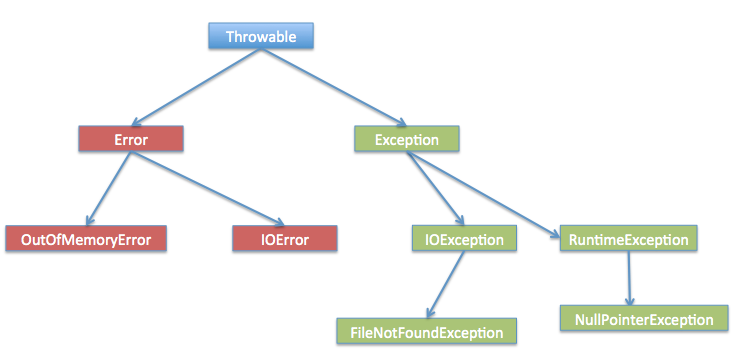

# The grammar of java

## 数据类型

byte:

- 数据类型是8位

short:

- 数据类型是16位

int:

- 数据类型是32位

long:

- 数据类型是64位

float:

- 单精度浮点数

double:

- 双精度浮点数

boolean:

- 存储bool量

char:

- 存储任何字符

## Number & Math类

### Number子类

> Java为每一个数据类型都封装了对应的包装类

| 包装类    | 基本数据类型 |
| --------- | ------------ |
| Booleans  | boolean      |
| Byte      | byte         |
| Short     | short        |
| Integer   | int          |
| Long      | long         |
| Character | char         |
| Float     | float        |
| Double    | double       |

```java
public class Main {
    public static void main(String[] args) {
        Integer x = 5;
        System.out.println(x);
    }
}
```

一些基本方法

| 名称        | 描述                                 |
| ----------- | ------------------------------------ |
| xxxValue()  | 将Number对象转换为xxx数据类型并返回  |
| compareTo() | 将Number对象与参数比较               |
| equals()    | 判断Number对象是否与参数相等         |
| valueOf()   | 返回一个Number对象指定的内置数据类型 |
| toString()  | 以字符串形式返回值                   |
| paraseInt() | 将字符串解析为int类型                |

用法

paraseInt()

```java
public class Main {
    public static void main(String[] args) {
        String re = "10.0";
        double x = Double.parseDouble(re);
        System.out.println(x);
    }
}
```

### Math类

> Math类包含了基本的数学运算
> Math类的方法都被定义为`static`形式，可以在主函数直接调用

```java
public class Main {
    public static void main(String[] args) {
        System.out.println("The sin value of 90 degree is: " + Math.sin(Math.PI / 2.0));
        System.out.println("The cos value of 0 degree is: " + Math.cos(0));
        System.out.println("The tan value of 60 degree is: " + Math.tan(Math.PI / 3.0));
        System.out.println("The degree of PI / 2 is: " + Math.toDegrees(Math.PI / 2));
    }
}
```

基本方法

| 名称     | 描述                                     |
| -------- | ---------------------------------------- |
| abs()    | 返回参数的绝对值                         |
| ceil()   | 返回向上取整的给定参数的整数             |
| floor()  | 返回向下取整的给定参数的整数             |
| rint()   | 返回与参数最接近的整数，返回类型为double |
| round()  | 表示四舍五入 Math.floor(x + 0.5)         |
| min()    | 返回两个参数中的最小值                   |
| max()    | 返回两个参数中的最大值                   |
| pow()    | 返回第一个参数的第二个参数的次方         |
| sqrt()   | 返回参数的算术平方根                     |
| random() | 返回一个随机数                           |

## Character类

```java
public class Main {
    public static void main(String[] args) {
        //NOTE: 定义一个字符串数组
        char[] test = {'h' , 'e' , 'l' , 'l' , 'o'};
        for(char ch : test) {
            System.out.print(ch);
        }
        System.out.println();
        char ch = 'h';
        System.out.println(ch);
        //NOTE: Character字符串数组
        Character[] test_2 = {'h' , 'e' , 'l' , 'l' , 'o'};
        System.out.println(test_2[1]);
    }
}
```

基本方法

| 方法           | 说明                                  |
| -------------- | ------------------------------------- |
| isLetter()     | 是否是一个字母                        |
| isDigit()      | 是否是一个数字字符                    |
| isWhiteSpace() | 是否是一个空白字符                    |
| isUpperCase()  | 是否是大写字母                        |
| isLowerCase()  | 是否是小写字母                        |
| toString()     | 返回字符的字符串形式，字符串的长度为1 |

## String类

> Java提供了String类来创建和操作字符串

字符串创建

```java
        //NOTE: 创建字符串
        String tmp = "noob";
        String tmp2 = new String("awdawd");
        System.out.println(tmp);
        System.out.println(tmp2);
        //NOTE: 用字符串数组创建字符串
        char[] hello = {'h' , 'e' , 'l' , 'l' , 'o'};
        String tmp3 = new String(hello);
        System.out.println(tmp3);
        String tmp4 = tmp2; // NOTE: 这种创建方式是引用

```

求字符串长度

> length()

```java
        //NOTE: 求字符串长度
        String world = "world";
        System.out.println(world.length());

```

连接字符串

> concat(String) 返回一个连接好字符串

```java
        //NOTE: 连接字符串
        String s1 = "hello, " , s2 = "world!";
        String s3 = s1.concat(s2);
        System.out.println(s3);

```

创建格式化字符串

String类使用静态方法format()返回一个String对象而不是PrintStream对象
String类的静态方法format()能用来创建可复用的格式化字符串

```java
        //NOTE: 创建格式化字符串
        String fs;
        fs = String.format("float is: " + "%f , int is: " + "%d , String is: " + "%s" , 10.1 , 12 , s3);
        System.out.println(fs);
```

基本方法

| 名称                                           | 描述                                                                           |
| ---------------------------------------------- | ------------------------------------------------------------------------------ |
| char charAt(int index)                         | 返回指定索引处的char值                                                         |
| int compareTo(String anotherString)            | 按字典序比较两个字符串                                                         |
| int compareToIgnoreCase(String str)            | 按字典序比较两个字符串(忽略大小写)                                             |
| boolean contentEquals(StringBuffer sb)         | 当且仅当字符串与指定的StringBuffer有相同顺序的字符时候返回真。                 |
| int indexOf(String str)                        | 返回指定子字符串在此字符串中第一次出现处的索引。                               |
| int indexOf(String str , int from index)       | 返回指定子字符串在此字符串中第一次出现处的索引，从指定的索引开始。             |
| int lastIndexOf(int ch)                        | 返回指定字符在此字符串中最后一次出现处的索引。                                 |
| int lastIndexOf(int ch, int fromIndex)         | 返回指定字符在此字符串中最后一次出现处的索引，从指定的索引处开始进行反向搜索。 |
| int lastIndexOf(String str)                    | 返回指定子字符串在此字符串中最右边出现处的索引。                               |
| int lastIndexOf(String str, int fromIndex)     | 返回指定子字符串在此字符串中最后一次出现处的索引，从指定的索引开始反向搜索。   |
| String toUpperCase()                           | 使用默认语言环境的规则将此 String 中的所有字符都转换为大写。                   |
| String toLowerCase()                           | 使用默认语言环境的规则将此 String 中的所有字符都转换为小写。                   |
| char[] toCharArray()                           | 将此字符串转换为一个新的字符数组。                                             |
| String substring(int beginIndex, int endIndex) | 返回一个新字符串，它是此字符串的一个子字符串。                                 |
| String substring(int beginIndex)               | 返回一个新的字符串，它是此字符串的一个子字符串。                               |

## StringBuffer & String Builder类

> 在使用 StringBuffer 类时，每次都会对 StringBuffer 对象本身进行操作，而不是生成新的对象，所以如果需要对字符串进行修改推荐使用 StringBuffer。
> 在不要求线程安全的情况下，使用String Builder类，String Builder会比StringBuffer快。

```java
        // NOTE: 先创建一个大小为10的空字符串
        StringBuilder sb = new StringBuilder(10);
        System.out.println(sb);
        // NOTE: 从尾部填充字符串
        sb.append("Runoob..");
        System.out.println(sb);
        sb.append("!");
        System.out.println(sb);
        // NOTE: 从指定索引处开始填充字符串，不足部分会扩容
        sb.insert(8 , "java");
        System.out.println(sb);
        // NOTE: 删除指定区间的字符串
        sb.delete(5 , 8);
        System.out.println(sb);
```

## 数组

### 创建数组

```java
        /*
        *   NOTE: 创建数组
        *   dataType[] array
        *   dataType[] array = new dataType[size]
        * */
        Integer[] arr = {1 , 2 , 3 , 4 , 5};
        Integer[] arr2 = new Integer[100];

```

### 遍历数组及访问数组

```java
        // NOTE: 遍历数组
        for(int i = 0; i < arr.length; i++) {
            System.out.println(arr[i]);
        }
        // NOTE: 范围遍历 for_each
        for(Integer value : arr) {
            System.out.println(value);
        }
```

### 数组作为函数参数

```java
    public static void printArray(Integer[] arr) {
        for(Integer value : arr) {
            System.out.println(value);
        }
    }
    printArray(new Integer[]{10 , 20 , 30 , 40});
```

### 数组作为返回值

```java
    public static Integer[] reverse(Integer[] arr) {
        Integer[] res = new Integer[arr.length];
        for(int i = 0, j = arr.length - 1; i < arr.length; i++ , j--) {
            res[i] = arr[j];
        }
        return res;
    }
    printArray(reverse(arr));
```

### 多维数组

```java
        /*
        *  NOTE: type[][] typeName = new type[length][length]
        * */

        String[][] arr = new String[20][30];

```

### Arrays类

> 包含了排序、查找、打印等内容

要先`import java.util.Arrays`

1. 打印数组

```java
        int [] a = {1 , 2 , 3,  4,  5};
        System.out.println(a);
        System.out.println(Arrays.toString(a)); // 打印数组元素的值

```

2. 升序排序

```java
        int [] b = {2 , 56  ,12893 ,12 , 23 ,3  , 5 , 67123};
        System.out.println(Arrays.toString(b)); // 打印数组元素的值
        Arrays.sort(b);
        System.out.println(Arrays.toString(b)); // 打印数组元素的值

```

3. 数组元素是引用类型的排序

```java
import java.util.Arrays;

class Man implements Comparable{
    int age , id;
    String name;
    public Man(int age , String name) {
        super(); // 父类型特征，先初始化父类型特征，再初始化子类
        this.age = age;
        this.name = name;
    }

    public int compareTo(Object o) {
        Man man = (Man) o;
        if(this.age < man.age) {
            return -1;
        } else if(this.age > man.age) {
            return 1;
        } else {
            return 0;
        }
    }
}

public class Main {
    public static void main(String[] args) {
        Man[] msMans = {new Man(3, "a"), new Man(60, "b"),new Man(2, "c")};
        Arrays.sort(msMans);
        System.out.println(Arrays.toString(msMans));
    }
}

```

```java
        Integer[] arr = {10 , 20 , 30 , 40 , 50 , 60 , 70};
        int x = Arrays.binarySearch(arr , 30);
        System.out.println(x);

```

5. 填充数组

```java
        int[] a = {1,2,323,23,543,12,59};
        System.out.println(Arrays.toString(a));
        Arrays.fill(a , 10);
        System.out.println(Arrays.toString(a));
```

## 方法

1. 定义

```java
修饰符 返回值类型 方法名(参数类型 参数名){
    ...
    方法体
    ...
    return 返回值;
}
```

2. 可变参数

```java
    public static void print(double... args) {
        if(args.length == 0) {
            System.out.println("No argument passed");
        }

        for(double val : args) {
            System.out.print(val + ' ');
        }
        System.out.println();
    }
    public static void main(String[] args) {
        print(10.1 , 2.1 , 3.2);
    }
```

3. finalize()方法 (弃用)

> 这种方法在对象被垃圾收集器析构前调用，用来清除回收对象

在finalize()方法里，必须指定在对象销毁时候要执行的操作  
一般格式是

```java
protected void finalize() {
    // NOTE: terminate your code
}
```

实例

```java
    class Cake extends Object{
        private int id;
        public Cake(int id) {
            this.id = id;
            System.out.println("Cake Object " + id + "is created");
        }

        protected void finalize() throws java.lang.Throwable {
            super.finalize();
            System.out.println("Cake Object " + id + "is disposed");
        }
    }
    public static void main(String[] args) {
        Cake c1 = new Cake(1);
        Cake c2 = new Cake(2);
        Cake c3 = new Cake(3);

        c2 = c3 = null;
        System.gc();
    }
```

## Stream, File, IO

`java.io`包含了所有操作输入、输出需要的类

使用这些类之前要先`import java.io.*`

### 读取控制台输入

Java的控制台输入由`System.in`完成。  
为了获得一个绑定到控制台的字符串，你可以把`System.in`包装在一个`BuffererReader`对象中来创建一个字符串流。

```Java
    BufferedReader br = new BufferedReader(new InputStreamReader(System.in));
```

创建完`BufferedReader`对象之后，可以使用其中的`read()`方法来获取控制台的一个字符，或者使用`readLine()`方法来获取一个字符串

### 从控制台读取多字符输入

```java
    public static void main(String[] args) throws IOException {
        BufferedReader br = new BufferedReader(new InputStreamReader(System.in));
        char c;
        System.out.println("Input something, press 'q' to quit");
        // Read
        do {
            c = (char) br.read();
            System.out.println(c);
        } while(c != 'q');
    }
```

### 从控制台读取字符串

```java
    public static void main(String[] args) throws IOException {
        BufferedReader br = new BufferedReader(new InputStreamReader(System.in));
        String read;
        System.out.println("Enter lines of text");
        System.out.println("Enter \"end\" to quit");
        // Read
        do {
           read = br.readLine();
           System.out.println(read);
        } while(!read.equals("end"));
    }

```

### 读写文件


#### FileInputStream

该流用于从文件读取数据，它的对象可以用关键字 new 来创建。

创建方法:

```java
InputStream f = new FileInputStream("C:/java/hello");
File f = new File("C:/java/hello");
InputStream in = new FileInputStream(f);
```

基本方法

| 名称                                         | 描述                                                                            |
| -------------------------------------------- | ------------------------------------------------------------------------------- |
| public void close() throws IOException       | 关闭文件输入流并释放与此流相关的的所有系统资源。抛出IOException异常             |
| public int read(int r) throws IOException    | 从InputStream对象读取指定字节的数据。返回下一字节的数据，如果已经到结尾则返回-1 |
| public int read(byte[] r) throws IOException | 从输入流读取r.length长度的字节。返回读取的字节数，如果是文件结尾则返回-1        |
| public int available() throws IOException    | 返回下一次对此输入流调用的方法可以不接受阻塞地从此输入流读取的字节数。          |

#### FileOutputStream

该类用来创建一个文件并向文件中写数据。
如果该文件不存在，则会自动创建。

创建方法

```java
OutputStream f = new FileOutputStream("C:/java/hello")
File f = new File("C:/java/hello");
OutputStream fOut = new FileOutputStream(f);
```

基本方法

| 名称                                           | 描述                                                            |
| ---------------------------------------------- | --------------------------------------------------------------- |
| public void close() throws IOException         | 关闭此文件的输出流并释放有关的所有系统资源。抛出IOException异常 |
| public void write(int w) throws IOException    | 把指定的字节写入到流中                                          |
| public void write(byte[] w) throws IOException | 把指定的数组w.length长度的字节写到OutputStream中                |

```java
    public static void main(String[] args) {
        try{
            byte bWrite[] = {11 , 23 , 3 , 40 , 5};
            OutputStream os = new FileOutputStream("output.txt");
            for(byte value : bWrite) {
                os.write(value);
            }
            os.close();

            InputStream is = new FileInputStream("input.txt");
            int size = is.available();

            for(int i = 0; i < size; i++) {
                System.out.print((char) is.read() + " ");
            }
            is.close();
        } catch(IOException e) {
            System.out.println("Exception");
        }
    }
```

#### Scanner类

可以通过Scanner类来获取用户输入

创建方法

```java
    import java.util.Scanner;
    Scanner sc = new Scanner(System.in);
```

在读取字符串的时候，通常需要使用`hasNext()`与`hasNextLine`判断是否还有输入的数据

```java
    public static void main(String[] args) {
        Scanner sc = new Scanner(System.in);
        // Read
        System.out.println("Input something");
        if (sc.hasNext()) {
            String str1 = sc.next();
            System.out.println(str1);
        }
        sc.close();
    }
```

```java
    public static void main(String[] args) {
        Scanner sc = new Scanner(System.in);
        // Read
        System.out.println("Input something");
        if (sc.hasNextLine()) {
            String str1 = sc.nextLine();
            System.out.println(str1);
        }
        sc.close();
    }
```

##### next与nextLine的区别

next():

1. 一定要读取到有效字符后才可以结束输入
2. 对输入有效字符之前遇到的空白，next()方法会自动将其去掉
3. 只有输入有效字符之后才将其后面输入的空白作为分隔符或者结束符
4. next()不能的得到带有空格的字符串

nextLine():

1. 以`Enter`为结束符，也就是说，nextLine()方法返回的是输入回撤之前的所有字符
2. 可以获得空白

如果要输入int或float类型的数据，在Scanner类中也有支持，但是在输入之前最好先使用hasNextXXX()方法进行验证，再使用nextXXX()来读取

```java
    public static void main(String[] args) {
        Scanner sc = new Scanner(System.in);
        // Read
        int i = 0;
        float f = 0.0f;
        System.out.println("Input Integer");
        if(sc.hasNextInt()) {
            i = sc.nextInt();
        }
        System.out.println("The Integer is: " + i);

        System.out.println("Input Float");
        if(sc.hasNextFloat()) {
            f = sc.nextFloat();
        }
        System.out.println("The Float is: " + f);
        sc.close();
    }
```

例如计算输入的数的总和和平均值

```java
    public static void main(String[] args) {
        System.out.println("Input some value");
        Scanner sc = new Scanner(System.in);

        double sum = 0;
        int cnt = 0;
        while(sc.hasNextDouble()) {
            double m = sc.nextDouble();
            sum += m;
            cnt++;
        }
        // NOTE: 如果需要退出循环，只需要输入一个非数字字符即可

        System.out.println("The sum is: " + sum);
        System.out.println("The avg is: " + sum / cnt);
    }
```

## 异常处理

有三种异常类型：

- 检查型异常: 最具代表的检查性异常是用户错误或问题引起的异常，这是程序员无法预见的。例如要打开一个不存在文件时，一个异常就发生了，这些异常在编译时不能被简单地忽略。
- 运行时异常：运行时异常是可能被程序员避免的异常。与检查性异常相反，运行时异常可以在编译时被忽略。
- 错误： 错误不是异常，而是脱离程序员控制的问题。错误在代码中通常被忽略。例如，当栈溢出时，一个错误就发生了，它们在编译也检查不到的。

### Exception类的层次

所有的异常类是从`java.lang.Exception`类继承的子类



### 捕获异常

```java
try {
    // Your code
} catch(ExceptionName e) {
    // Catch 块
}
```

实例：
检测数组索引是否合法

```java
    public static void main(String[] args) {
       try{
           int a[] = new int[2];
           Scanner sc = new Scanner(System.in);
           System.out.println("please input a index");
           int index = 0;
           if(sc.hasNextInt()) {
               index = sc.nextInt();
           }
           // NOTE: 如果索引不合法，数组就会抛出ArrayIndexOutOfBoundsException异常
           System.out.println("Access element successfully: " + a[index]);
       }  catch(ArrayIndexOutOfBoundsException e) {
           System.out.println("Exception thrown: " + e);
       }
       System.out.println("Out of the block");
    }
```

#### 多重捕获块

```java
try{

} catch(ExceptionType e1) {

} catch(ExceptionName e2) {

} catch(ExceptionType e3) {

}
```

```java
try {
    file = new FileInputStream(fileName);
    x = (byte) file.read();
} catch(FileNotFoundException f) { // Not valid!
    f.printStackTrace();
    return -1;
} catch(IOException i) {
    i.printStackTrace();
    return -1;
}
```

上述代码中，抛出的异常会去匹配对应的异常类型的catch块

#### throw / throws 关键字

`throw`关键字用于在代码中抛出异常，`throws`关键字用于在方法声明中指定可能会抛出的异常类型

##### throw 关键字

通常情况下，当代码执行到某个条件下无法继续正常执行时，可以使用`throw`关键字抛出异常，已告知调用者当前代码的执行状态

例如下面的代码，用来判断参数是否小于0,如果是，则抛出一个IllegalArgumentException异常

```java
    public static void test(int num) {
        if(num < 0) {
            throw new IllegalArgumentException("Number must be greater than 0");
        }
    }
```

##### throws 关键字

`throws`关键字用于在方法声明中指定该方法可能抛出异常。当方法内部抛出指定类型的异常时，该异常会被传递给调用该方法的代码，并在该代码中处理异常

例如下面的代码，当readFile方法内部发生异常时，会将该异常传递给调用该方法的代码。在调用该方法的代码中，必须捕获或声明处理IOException

```java
    public static void readFile(String filePath) throws IOException {
        BufferedReader bf = new BufferedReader(new FileReader(filePath));
        String line = bf.readLine();
        while(line != null) {
            System.out.println(line);
            line = bf.readLine();
        }
        bf.close();
    }
```

一个方法可以声明抛出多个异常，多个异常之间用逗号隔开

```java
    public static void withdraw(double amount) throws RemoteException, InsufficientResourcesException {
        // do something
    }

```

#### finally 关键字

`finally` 关键字用来创建在 `try` 代码块后面执行的代码块。

无论是否发生异常，`finally` 代码块中的代码总会被执行。

在 `finally` 代码块中，可以运行清理类型等收尾善后性质的语句。


```java
try {

} catch(ExceptionType e) {

} finally {

}
```

实例：

```java
    public static void main(String[] args) {
        int[] a = new int[2];
        try {
            System.out.println("Access element three: " + a[3]);
        } catch (ArrayIndexOutOfBoundsException e) {
            System.out.println("Exception thrown: " + e);
        } finally {
            a[0] = 6;
            System.out.println("First element value: " + a[0]);
            System.out.println("The finally statement is excuted");
        }
    }
```

注意：

- catch块不能独立于try块
- try块后面不能没有catch块也没finally块
- try, catch, finally块之间不能添加任何代码

#### try-with-source

我们可以使用`try-with-source`语法糖来打开资源，并且可以在语句执行完毕后确保每个资源都被自动关闭

```java
    public static void main(String[] args) throws IOException {
        try (Scanner sc = new Scanner(System.in)){
            PrintWriter writer = new PrintWriter(new File("testWrite.txt"));
            while(sc.hasNext()) {
                writer.print(sc.next());
            }
        } 
    }
```

多个资源回收时，`try-with-source`语句以相反的顺序关闭这些资源


### 声明自定义异常

在java编写自定义异常时，要记住以下几点：

- 所有异常都必须是`Throwable`的子类
- 如果希望写一个检查性异常类，则需要继承`Exception`类。
- 如果希望写一个运行时异常类，那么则需要继承`RuntimeException`类


创建方式:
```java
class MyException extends Exception {

}
```
例如我们要做一个检查银行账户类，用户在取款时，有可能余额小于取款额，这时我们就可以设计一个资金不足异常类，用于在这种情况下抛出异常

```java
class InsufficientFundsException extends Exception {
    private double amount;
    public InsufficientFundsException(double amount) {
        this.amount = amount;
    }
    public double getAmount() {
        return amount;
    }
}

```

然后再设计一个检查账户类

```java
class CheckingAccount {

    // balance是余额，number是卡号
    private double balance;
    private int number;

    public CheckingAccount(int num) {
        this.number = num;
    }

    // 存钱
    public void deposit(double amount) {
        this.balance = amount;
    }
    
    // 取款
    public void withdraw(double amount) throws InsufficientFundsException {
        if(balance >= amount) {
            balance -= amount;
        } else {
            double needs = amount - balance;
            throw new InsufficientFundsException(needs);
        }
    }

    // 返回余额
    public double getBalance() {
        return balance;
    }

    // 返回卡号
    public int getNumber() {
        return number;
    }
}

```

测试如下：

```java
    public static void main(String[] args) {
        CheckingAccount c = new CheckingAccount(123);
        System.out.println("deposit 5000.0...");
        c.deposit(5000.0);
        try {
            System.out.println("\nWithdrawing $1000...");
            c.withdraw(100);
            System.out.println("\nWithdrawing $6000...");
            c.withdraw(6000);
        } catch(InsufficientFundsException e) {
            System.out.println("Sorry, but you are shot $" + e.getAmount());
            e.printStackTrace();
        }
    }

```

结果如下：

```
InsufficientFundsException
	at CheckingAccount.withdraw(Main.java:40)
	at Main.main(Main.java:63)
deposit 5000.0...

Withdrawing $1000...

Withdrawing $6000...
Sorry, but you are shot $1100.0


```

## 面向对象

### 继承

#### 特性

- 子类拥有父类非`private`属性、方法
- 子类拥有自己的属性和方法，即子类可以对父类进行扩展
- 子类可以用自己的方式实现父类的方法
- Java的继承是单继承，但是可以多重继承，无法多继承


继承格式:

```java
class 父类 {

}

class 子类 extends 父类 {

}
```

#### 继承关键字

继承可以使用`extends`和`implements`关键字，而且所有的类都是继承于`java.lang.Object`，当一个类没有继承的两个关键字，则默认继承`Object`祖先类

**extends, super, this**关键字

- extends只能继承一个类
- super用来实现对父类成员的访问，用来引用当前的父类对象
- this，指向自己的引用

```java

class Animal {
    private String name;
    private int id;

    public Animal() {
        this.name = "None";
        this.id = 0;
    }
    public Animal(String name , int id) {
        this.name = name;
        this.id = id;
    }

    public void eat() {
        System.out.println("Eating");
    }

    public void sleep() {
        System.out.println("Sleeping");
    }

    public void introduction() {
        System.out.println("My name is: " + name + " and my id is: " + id);
    }

    public void test() {
        System.out.println("This is Animal");
    }
}

class Penguin extends Animal {
    public Penguin(String name , int id) {
        super(name , id);
    }
}

class Mouse extends Animal {
    public Mouse(String name , int id) {
        super(name , id);
    }
}

class Dog extends Animal {
    public void test() {
        System.out.println("This is dog");
    }
    public void test2() {
        super.test();
    }
}

public class Main {
    public static void main(String[] args) {
        Mouse mou = new Mouse("Mou" , 1);
        Penguin pen = new Penguin("Pen" , 1);
        pen.eat();
        mou.introduction();
        Dog dog = new Dog();
        dog.test();
        dog.test2();
    }
}
```

**implements**关键字

> 可以是java变相具有多继承的特性，使用范围为类继承接口的情况，可以同时继承多个接口

```java
interface A {
    public void eat();
    public void sleep();
}

interface B {
    public void show();
}

abstract class C implements A , B {
}

```
**final**关键字

- 使用`final`关键字声明类，就是把类定义为最终类，不能被继承，或者用于修饰方法，该方法不能被子类重写

格式：

```java

// 声明类
final class A {}

// 声明方法

(public, private, default, protected) final return type functionName() {}
```
#### 构造器

如果父类的构造器带有参数，则必须在子类的构造器中显式地通过`super`关键字调用父类的构造器并配以适当的参数列表，如果父类没有则不需要，系统会自动调用父类的无参构造器

```java
class SuperClass {
    private int n;
   public SuperClass() {
       System.out.println("call SuperClass()");
   }
   public SuperClass(int n) {
       this.n = n;
       System.out.println("call SuperClass(int n)");
   }
}

class SubClass extends SuperClass {
   private int n;
   public SubClass(int n) {
       super(n);
       System.out.println("SubClass(n)");
       this.n = n;
   }
    public SubClass() {
        System.out.println("SubClass");
    }

}

public class Main {
    public static void main(String[] args) {
        System.out.println("------SubClass 类继承------");
        SubClass sc1 = new SubClass();
        SubClass sc2 = new SubClass(100);
        System.out.println("------SubClass2 类继承------");
    }
}
```

## Override & Overload

### 重写(Override)

重写是子类对父类的允许访问的方法的实现过程重写，返回值和形参都不改变。  
重写方法不能抛出新的检查异常或者比被重写的方法声明更加广泛的异常。例如：父类的一个方法声明了一个检查异常IOException，但是在重写这个方法的时候不能抛出Exception异常，因为Exception是IOException的父类，抛出IOException或者IOException的子类异常

```java
class Animal {
    public void move() {
        System.out.println("Moving....");
    }
}

class Dog extends Animal {
    public void move() {
        System.out.println("The dog is moving...");
    }
}

public class Main {
    public static void main(String[] args) {
        Animal a = new Animal();
        Animal b = new Dog();
        a.move();
        b.move();
    }
}

```

在上面的代码中，Dog类继承自Animal类并重写了move方法，尽管b是属于Animal类型，但它运行的是Dog类的move方法。注意，如果Dog类存在Animal类中没有的方法，并且在调用了这个方法，编译不会通过。


方法的重写原则

- 参数列表和被重写的方法的参数列表必须完全相同
- 返回类型与被重写的方法的返回类型可以不相同，但是必须是父类返回值的派生类
- 访问权限不能比父类被重写的方法的访问权限更低。
- 父类的成员方法只能被它的子类重写
- 声明为 static 的方法不能被重写，但是能够被再次声明。
- 声明为 final 的方法不能被重写。
- 子类和父类在同一个包中，那么子类可以重写父类所有方法，除了声明为 private 和 final 的方法。
- 子类和父类不在同一个包中，那么子类只能够重写父类的声明为 public 和 protected 的非 final 方法。
- 重写的方法能够抛出任何非强制异常，无论被重写的方法是否抛出异常。但是，重写的方法不能抛出新的强制性异常，或者比被重写方法声明的更广泛的强制性异常，反之则可以。
- 构造方法不能被重写。


**Super**关键字

当需要在子类中调用父类的被重写方法时，要使用 super 关键字。

```java
class Animal {
    public void move() {
        System.out.println("Moving....");
    }
}

class Dog extends Animal {
    public void move() {
        super.move();
        System.out.println("The dog is moving...");
    }
}

public class Main {
    public static void main(String[] args) {
        Animal b = new Dog();
        b.move();
    }
}
```

### 重载(Overload)


